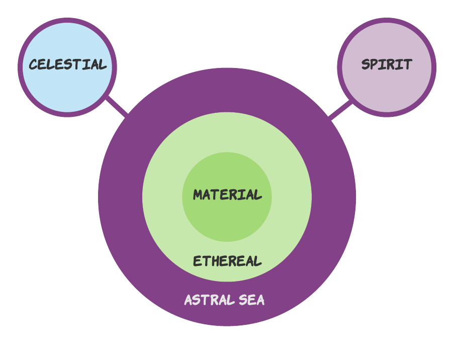

# Recap

Highlights from previous sessions worth remembering.

 
 

## Old news

* The Fellowship have rapidly adjusted to Erath. In only three weeks, each of the party have discovered and developed talents well beyond anything they had accomplished in their entire lives prior to coming here. This recognition may be exhilarating or frightening, natural or unnatural depending on the character's perspective. 
* In the same period, some Shadow force has also arrived on Erath and so far has also grown rapidly. By contrast, the Banes have been around for awhile, though you have learned little about these catastrophic events or how frequently they occur.
* Regardless, the banes are too powerful and too erratic to be the product of natural forces alone. Therefore there must be a magical component to them.
* Much of the magical fabric of Erath originates from, works through, and is amplified by complex networks, from the Great Trees and the river-dwelling Sisters of the Undine to the Ethewa themselves, who weave their magic together to help sustain the land during the Banes. And then of course there are the portals themselves, bridges that connect worlds together.
* It is not hard to see how vulnerable Erath would be if the health of these networks were somehow compromised, the impact that could have.

## Last session

# Scenes

* Oisin is guided again by the Old Crone and her own innate knowledge of the portals—the shadow presence here is growing. If the phase bubble they are in collapses, whatever is in this room will return to Erath. (She must keep the portal open until they have defeated.)
* Skol watches in horror as he realizes that what is happening to Kobra could happen to him.
* Once she is bloodied, Kobra speaks to Graegon: 
    * Kobra tells him that her struggle with the Shadow within has failed, and though she is dying, the Shadow is not.
    * Nevertheless, Graegon's "return" to Erath is her triumph—the quest to which she devoted her life has succeeded. Her broodline has produced a wyrmling descended not only of Kobra but of Kai as well, a child of Erath yet born and tempered in another world. 
    * For his return, he has her eternal favor. Nothing will change that love, even my death.
    * The portal is using Kobra and the fragment of Kai withini her to forge a dragon lich, an avatar of Shadow.
    * If Graegon can keep her attention, perhaps he can keep the Shadow's attention as well—which is goading the part of Kai that lives within me, stoking her hatred of the STEAM gear. (Special Tactically Enriched Arcane Mechwarrior?)
    * She asks him to forgive himself for killing his brother monks—he did not understand who he was.
* Steam has been awakened to new knowledge of his armor. He has new weapons and abilities. He can use them on his next turn, if he survives it.
* The defeat of Kobra'kai. The dragon's last conscious effort summons her remaining strength and the ember of Kai that makes her an avatar—Kai casts [Mirage Arcane](https://www.dndbeyond.com/spells/mirage-arcane), serving two functions:
    * as an attempt to fool the emerging Shadowir that they are already in Erath, hopefully to distract them long enough for 
    * to provide better terrain for the party to move around in and to give nature for Dunbar to draw on.
    * As Kai's magic remakes the world, at least by appearances, it draws out a canyon between the party and the fallen Kobra. 
    * The circle at the top of the sanctuary dilates like an iris until there is only clear blue sky and endless green prairie surrounding the battle field.
    * A small forest begins to spring up in the canyon that separates The Strangers from the Shadow (and the portal). 
    * But then it is as if the Arcane Image is stunted somehow. The trees stop growing, and all energy focuses on the portal.
    * There on the portal a single tree is growing and then fading, its bark consumed with blotches of dark purple like great bruises that consume the tree and its leaves. 
    * Just as the creative magic of the spell tails out, the large tree completes its metamorphosis into shadow. 
    * And then nothing. 
* The portal war begins. The party have about 10m before  the shadow tree starts corrupting the other trees in the canyon, extending its consumptive powers and creating shadow. If the tree manages to consume all of the trees before the party can heal them (or the portal closes), the party loses and the shadow collapses the phase bubble into Ethawa and flees.
    * Each turn the tree gets three legendary actions:
        * **Poison the network.** The Shadow can target one healthy tree that is adjacent to a shadow tree. The target is infected and drawn into the shadow.
        * **Ripen fruit.** The Shadow can ripen one of the large black fruit that hang from the shadow trees, summoning one 'slot' of creatures—1 party level creature, 2 gangs, or 4 mobs. The tree can create 8 slots worth of creatures per day and can attempt to regain 1 slot at the beginning of each of its turns (**Recharge**: 6). 
    * The players can heal a shadow tree by casting any of these means:
        * Cast any restorative spell, such as Healing Word, Cure Wounds, Plant Growth, Mending, or any other restorative spell.
        * Use any ability that restores hit points, such as Lay on Hands.

# Event tracker

Use these tables to track how characters react or are affected by different events.

## Kobra returns

|                                               | Dunbar | Graegon | Oisin                                                        | Skol                                                          | Steam                                                     | Wangari                                                        |
|-----------------------------------------------|--------|---------|--------------------------------------------------------------|---------------------------------------------------------------|-----------------------------------------------------------|----------------------------------------------------------------|
| | | | | | | |

## Back at Kobra'kai Sanctuary

|                                               | Dunbar | Graegon | Oisin                                                        | Skol                                                          | Steam                                                     | Wangari                                                        |
|-----------------------------------------------|--------|---------|--------------------------------------------------------------|---------------------------------------------------------------|-----------------------------------------------------------|----------------------------------------------------------------|
| **Dareel confronts party with news of Taria** |        |         |                                                              | [Skol's Shadow Strikes](/02-players/skol#skol'sshadowstrikes) |                                                           |                                                                |
| **Oisin investigates gear**                   |        |         |                                                              | [Action at a distance](/02-players/skol#actionatadistance)    |                                                           |                                                                |
| **Oisin confronts Dendra**                    |        |         |                                                              |                                                               |                                                           |                                                                |
| **Steam opens puzzlebox**                     |        |         |                                                              |                                                               | [What's in the Box?](../02-players/steam#what'sinthebox?) |                                                                |

## Possible opponents

### Trios (2 slots)

* Ancient Mandriano—Shadowir treants grown in soil defiled by ritual sacrifice.
* Voidpool—super shadow ooze with embedded void portal (TOB 2: 362)
* Treant, Weeping—corrupted shadow trees (TOB 1: p. 388)

### Party (1 slot)

When a party level creature is summoned, the first to arrive in humanoid form jumps from the tree as the hanged man. It hangs still in the noose for a moment, swaying, then shrugs at the party across the canyon. Its sinewy legs grow down to the earth, and it retracts its sinewy head through the noose. It recomposes its humanoid shape and steps right into motion . . .   
* Mandrianos—nature energy defined by ritual sacrifice (CC: p. 261).
* Zeitgeists—shadow dragonborn emerge from embedded in dragon glass, driven insane, time unstable from transport (TOB 2: 383). Use **HP** 60 and tune the zeitgeist's attacks:
    * **Darting Rend (Darting Form Only).** *Melee Weapon Attack:* +7 to hit, reach 10ft, one target. *Hit:* 6(1d4+4) slashing damage plus 7(2d6) force damage.
    * **Sluggish Slam** *Melee Weapon Attack:* +5 to hit, reach 5 feet, one target. *Hit:* 7 (1d8+3) bludgeoning damage plus 7 (2d6) force damage. If the zeitgeist scores a critical hit, the target is also knocked prone.
* [Shadow/Frost Druid](https://www.dndbeyond.com/monsters/frost-druid)

### Gang (2 per slot)

* [Derro savant](https://www.dndbeyond.com/monsters/derro-savant)—shadow mage (TOB 2: p. 137)
* [Shadow Mastiff](https://www.dndbeyond.com/monsters/shadow-mastiff)—monstrous war dogs with massive heads built entirely to accommodate grotesquely oversized jaws stuffed full of sturdy canine teeth jutting out at every possible angle.

### Mobs (4 per slot)

* [Derro, shadowling](https://www.dndbeyond.com/monsters/derro)

> ### Interesting Encounter
>
> Someone wakes up with a dream wraith (CC p. 143) hovering over them.

## Friendly reminders

