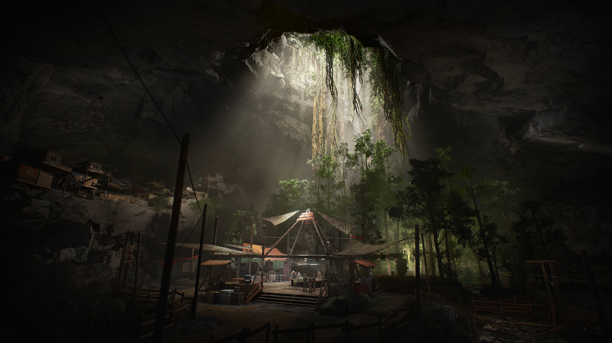

Graegon Fletcher, blue dragonborn monk of the Order of Dionysus—who killed all of his brother monks in a fit of rage and has been despondent ever since—discovers the monks of Kobra'kai in Erath. 

# Surrounded

This arc kicks off when the party are surrounded by the Kobra'kai shortly after exiting the floodgate of Ean'del cistern.

# A Kobra'kai challenge

When [the party exits the floodgate](/01-prep/sod-12-prep), they are surrounded by a band of monks, as evidenced by their dress and arms. A member of the band speaks to chastise the two young monks Graegon recognizes from the night before. 

He then turns and speaks to Graegon in draconic. The tone of his greeting is cordial. You hear the name "Kobra'kai." After introductions, he adds something with an air of menace.

## Called out

The Kobra'kai believe/think that Graegon could be the dragonborn child foretold in their founding lore—whose name they translate to _Kobra_.

And so the Kobra'kai leader gives Fletch a challenge:
* If he can defeat their trials and prove his worth —the Kobra will assist the party.
* If he fails, they will tell the assassin's where to find them/turn them in.

By the end of this trial, regardless, through a combination of action and flashboack, Graegon will discover his power —he will follow the [Way of the Ascendant Dragon](https://www.dndbeyond.com/classes/monk#WayoftheAscendantDragonUA).

Depending on his performance, they may also give him a [Ring of Free Action](https://www.dndbeyond.com/magic-items/ring-of-free-action)

## The Parable of the monk and the dragon

The Kobra'kai have a parable/founding myth about a brother who wandered off and fell into a well where he met a blue dragon:
* The brother was respected for his talent, which was almost unlimited, but he was _beloved_ for his humor, which often exceeded even his talent.
* Nevertheless, there were some who were jealous of his power, and so they got him drunk one festival, goaded him out into the hills with a challenge and followed him, where they from behind a great tree and watched him stumble into the well.
* The monk's brothers left, expecting that the fall had killed him, others joking that even if he didn't a dragon would get him. (This was long ago during a time when dragons were common on Erath.)
* But instead the brother survived, and when a young blue dragon showed up to see who what meal had tumbled into its lair, the monk befriended her with humor and the pair became friends.
* The monk stayed in the lair with the dragon, who gave the boy the ***Gift of Breath*** and the ***Dream of Flight***.
* And the two became like siblings, until one day the dragon's mother, an ancient blue, returned to the lair.
* To save the boy from her mother, the dragon transforms the boy into a blue and herself into a humanoid (dragonborn).
* She then uses an artifact from her mother's treasure hoard (shadyphid?) to open a portal to another world, through which she escapes, promising that one day her children would return to Erath.

# The hole-in-the-ground-gang

The the temple the Kobra lead the party to for sanctuary is actually a hole in the ground that opens into an underground grotto.

# The Kobra'kai

Kobra'kai initiates wear long loose shirts, adepts wear long vests with embroidered placards, and long loose-fitting pants bound into rugged slippers. Leaders like Dareel also wear kind of a veshti/long skirt of heavily embroidered fabric that tells the story of their own spiritual journey. The interior of these are often lined with blue silk infused with abjuration/protection magic.

The two [Kobra'kai initiates](https://www.dndbeyond.com/profile/monkeysan/characters/42306353), **Iggle** and **Fain** are there.

The following [Kobra'kai Adepts](https://ddb.ac/characters/42306353/0JwRyv) are also present:
* **Elbu, laughing otter** (shaggy male oruk)—Independent and Comical
* **Antle, quietfoot** (thin male ylve)—Quiet, Devoted
* **Roldo, swiftblade** (handsome, obsidian male ylve)—Tactful with outsiders, A joker among friends, and Welcoming
* **Guru, lightbringer** (lanky female oruk)—Strategic, Loves to debate
* **Dendra, iron ibis** (smart female goblyn)—Suspicious, Loyal, and Ambitious
    * Dendra notices [Oisin](/02-players/oisin) wearing Jindri's slippers as goblyn made and suspects they were stolen/looted, so she is making her displeasure known and tries to goad Oisin
* **Uppa, whistling bow** (singing male goblyn)—Lovable, Diplomatic, Attention-seeking.
    * Rides with [Dunbar](/02-players/dunbar) and the pair strike up a rapport.
* **Elith, eager sprinter** (strong female ylve)—Playful, Has a strong sense of values, Fast-paced.
    * Finds [Skol](/02-players/skol) ridiculous but in a good natured way. This is good for Skol, who has been having a rough time of it.
* **Lian, wise bat** (blind short female oruk)—Observant, Polite, A thrill-seeker, 
* **Janir, strident bear** (lean male oruk)—Powerful, Well-mannered, Motivational and Self-disciplined

# What ifs

* ***What if***—it turns out that the Blue Dragon went to Faerun, opening the door to a connection between Graegon and the Kobra?
    * That could make Graegon a relative of the Blue Dragon, or at least one with her blood in him.
* ***What if***—the Blue Dragon is an avatar of the Hierophant?
    * Or, rather than being the Hierophant, the Blue Dragon is somehow opposed to the Hierophant.
    * Be wary of putting Graegon and Oisin in opposition. Better to keep them on the same side and make them wonder how they might be connected.
* ***What if***—Kobra is an avatar of Kai?
* ***What if***—Kai'pow'eh, the iridescent blue drake that climbed out of the well, is the current avatar of Kai?! Or worse. . . a shadow Kai! Or maybe she *is* an avatar of the true Kai, but she is determined to kill the party, because they have brought the shadow?

