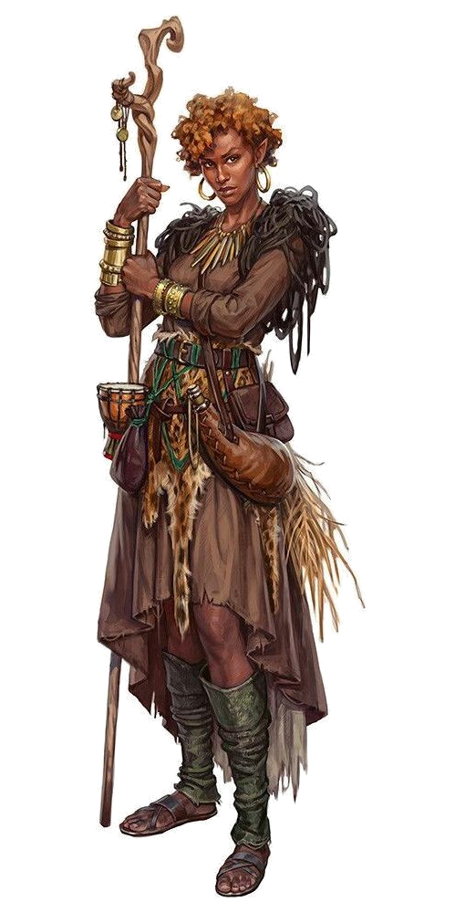

**[Aysana](https://www.dndbeyond.com/profile/monkeysan/characters/18382882) is a Kyodir and Ethewa Range Warden.** Sharp, strong-willed, and confident in both her skills and her leadership,
Aysana is on the clan council when the campaign begins.

**Highly Attuned.** Aysana is wily and agile in the hunt and, on the rare occasion that it is unavoidable, in battle as well. But it is the sheer magnitude of her presence and the power of her attunement to the world that is truly remarkable, inspiring awe in some but deep respect in all.

**Difficult to provoke, impossible to subdue.** Aysana reserves her fury for those who do not respect the land or the mission of the Ethewa to tend it. Once triggered, her anger is ferocious and unforgiving.

Aysana's incredible powers of observation and her limited tolerance for lazy thinking grant her a particularly biting sense of humor, though she is also playful, particularly with those she loves and children.

> ## Aysana Biko, Kyodir
>*Half-elf druid, chaotic good*
> ___
> **Armor Class**  15
> 
> **Hit Points**  51 (6d8+18)
> 
> **Speed** 30 ft.
>
> |STR|DEX|CON|INT|WIS|CHA|
> |:---:|:---:|:---:|:---:|:---:|:---:|
> |11 (+0)|18 (+4)|16 (+3)|14 (+2)|20 (+5)|9 (-1)|
> 
> **Skills** Arcana +5, Athletics +3, Insight +8, Nature +5, Perception +8, Survival +8
>
> **Condition Immunities** Charmed (A), Sleep (magic)
>
> **Senses** Passive Perception 21, Insight 16, Investigation 17, Darkvision 60ft.
>
> **Languages** Common, Druidic, Kyote, Sylvan
> 
> ### Abilities
>***Spellcasting.*** Drawing on the divine essence of nature itself, Aysana can cast spells to channel that essence.
>
>***Mighty Summoner.*** Any beast or fey Aysana conjures appears with 2 extra HP per Hit Die and its damage is considered magical.
> 
> ### Actions
>
> ***Quarterstaff.*** _Melee Weapon Attack:_ +3 to hit, range 80(320)ft. _Hit_: 1d6
>
> ***Shillelagh.*** _Melee Weapon Attack_:  +8 to hit, reach 5ft. _Hit:_ 1d8+5
>
> ***Magic Stone.*** _Ranged Weapon Attack_: +8 to hit, thrown 60ft. _Hit:_ 1d6+5
>
>***Spirit Totem.*** *Bonus Action:* Aysana can summon a spirit to a point within 60ft. Spirit creates an aura: Bear (endurance), Hawk (hunter), Unicorn (protection). 
>
>***Defensive Duelist.*** *Reaction:* When hit by a melee attack while wielding her quarterstaff, Aysana can add +2 to her AC.
> 
>### Spell List
>| Level |  | Slots |
>|:---:|:------------|:----:|
>|  0  | Druidcraft, Magic Stone, Shillelagh |
>|  1  | Create or Destroy Water, Cure Wounds, Goodberry, Speak With Animals| 4|
>|  2  | Animal Messenger, Darkvision, Healing Spirit, Locate Animals or Plants  | 3 |
>|  3  | Conjure Animals, Plant Growth, Speak with Plants | 3 |

