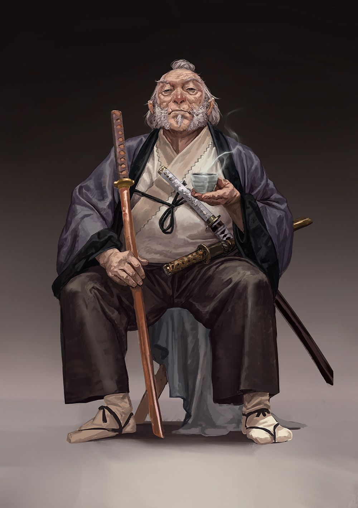

<table style='width:100%'>
    <tr>
        <td>
            
Monk, second rank, and Eye of the Teacher, Kobra'kai sect.

            
Ambushed The Strangers outside the Ean'del Cistern on the night of Taria Ganin's assassination.

            
Risked treason to lead The Strangers to a hidden Kobra'kai sanctuary where Lloth'Ivan's Shayadim assassins could not find them.

            
Challenged Graegon Fletcher to prove himself in the Trials of Kobra.

        </td>
        <td style='width:50%'>
            
            <ul style='list-style-type:none; padding-left:0'>
                <li style='margin:0'><strong>Class</strong> Monk (Cobalt Soul)</li>
                <li style='margin:0'><strong>Race</strong> Ylve–Oruk</li>
            </ul>
        </td>
    </tr>
</table>