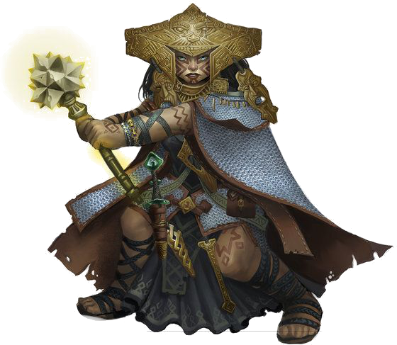

<table style='width:100%'>
    <tr>
        <td>
            
Grand Abuera at Ter'Rambla. Died defending the temple from a Shadowir onslaught during the first invasion.

            
Shortly before her death, Jindri received a visitation by a celestial—a fact confirmed by Wangari Shire, who detected the presence with her Divine Sense.

            
Corpse found and recovered by Dunbar Swiftide, who left her in the care of Lokuma'kai, a sister of the Undine.

            
Her <a href='/06-lore/04-jindris-faded-notes'>journal notes</a> contain the first known insights into the Shadowir invasion.

        </td>
        <td style='width:50%'>
            
            <ul style='list-style-type:none; padding-left:0'>
                <li style='margin:0'><strong>Class</strong> Cleric (Nature)</li>
                <li style='margin:0'><strong>Race</strong> Goblyn</li>
            </ul>
        </td>
    </tr>
</table>