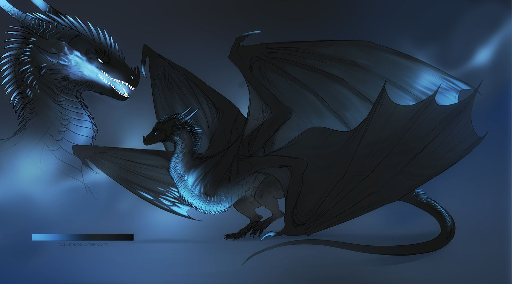
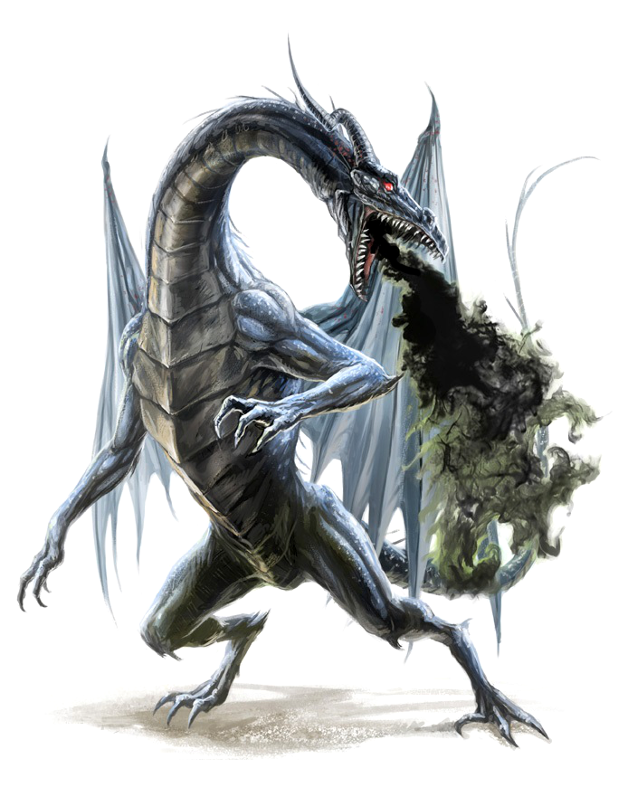

Having just defeated the Specter of Kobra, the Fellowship find themselves alone in some kind of between place, a lacuna in the space-time-magic around Erath. Where the Specter once fought, now there is an open portal, similar to the one that brought the party to Erath. 

Soon, Oisin detects vibrations in networks of magic that form this bridge between worlds. Oisin struggles to maintain control of the portal. The vibration grows. She desperately launches herself into the network to know what's happening. She cannot close the portal. Something is coming. . .

. . . Kobra, Avatar of Kai is here.

# Origin

Kobra is a blue dragon, born during an age when dragons were still known on Erath. She is the eldest of five hatchlings from the 33rd Brood of Tannit, who was queen of the Sirrin clan, which roosted in the Mor'dani ranges in a distributed network of lairs, broodhalls, and hoard sites.

# Becoming an Avatar

The [Parable of the Monk and the Dragon](/02-players/graegon#theparableofthemonkandthedragon) is a myth. Inevitably, though, the myth grew from fact more unlikely than the myth:

* There was a monk, but he was not a boy, but a girl disguised as a boy.
* And the girl was not a monk but an avatar of Kai herself, who had come to study with the monks so that the young goddess could know this martial order who revered her Serpent aspect.
* For Kai had been born with deep knowledge of Erath — in particular she knew the rivers that flowed from the Mor'dani to Mar'Illith where they joined the seas. And she new everything these rivers fed or passed through. She knew the waters themselves and could follow them through every creature that bathed or drank or spawned or died with her waters.
* And as with all of the gods, Kai was also born with a cache of secret, particular knowledge that lived only in Kai, hidden like an instinct even from herself until the time was right.
* And that knowledge now told her that Erath was becoming vulnerable, and if Erath became vulnerable, so too would the gods. So Kai set about looking for ways that Erath could protect herself. 
* And so one night she sat with her brother monks and gave them tea that let them see her true identity.
* The monks became ecstatic and frightened and grateful and jealous by turns, but after several hours of walking with Kai, they found themselves and began to pray together as one.
* Near this spot, Kai sensed the magic of a strange artifact and descended into a burrow, where she found an alien artifact lying in a hoard guarded by a juvenile blue brooding. This was Kobra.
* Kai showed herself to the young dragon, who had been living in the burrow for the better part of a century, during most of which she'd slept, growing in size and in spirit. 
* Kobra welcomed the young goddess and the pair spent the rest of the night in communion together and with the monks praying in their circle above. 
* They continued for weeks, Kai guiding their attention to the artifact, drawing on their prayer magic to study the artifact, until finally Kai was satisfied and roused Kobra and the monks from their conjunction.
* But before she did so, Kai hybridized the human form of her avatar with the blue dragon, leaving a piece of herself behind so that now Kobra was also an avatar of Kai. 
* And it was then that Kai turned to the alien artifact, which had drawn her into the burrow in the first place.
* Using the knowledge she had learned in the burrow and the secret knowledge she bore in her heart, Kai activated the artifact, and a portal opened.
* Kai then sent Kobra, now Kobra'kai, through the portal, which ended up leading her to Faerun. 
* And it is there that Kobra founded a race of blue dragonborn, descendants not only of Kobra but of Kai as well, children of Erath and yet born and tempered in another world so that when needed, they might return, able to fight for the gods and for Erath without being vulnerable to that which threatens it.
* Kai then withdrew, leaving behind a simulacrum of Kobra so that even Tannit would not know the difference.

# Homeward unbound

Kobra'kai is in Faerun when she discovers a portal, thanks to the Old Crone or some other Portal Witch. She is drawn home — the ache to re-unite with Kai, to be whole, is overwhelming — so she crosses over the Hierophant's bridge:

* In the process or some other way — perhaps Kai herself is the source? — Kobra becomes corrupted with Shadow as she walks the Hierophant's bridge and emerges before the party. 
* Her corruption exploits her desire to be home, to unite with Kai, and perverts it — into bitterness, grievance, and a need to be acknowledged that quickly descends into to fevered bloodlust.

## Kobra'kai speaks

### Emergent

When she first emerges from the portal, Kobra'kai is very much herself in first impression — beatific, regal, the culmination of dragonborn evolution, and yet she is the first in the line. Such is the way with gods and mortals.

She greets Graegon with warmth and love and pride. He is proof that her progeny succeed in returning to Erath. Kobra becomes excited at the thought of Kai's recognition for her success.  

But even during this initial greeting, there is an edge forming, a potential for menace, as she explains who she is and that she has crossed from Faerun's deep past:

> "I am Kobra, Avatar of Kai. I have come from your past my Wyrmling. Deep in your past. It was here that Kai blessed me with a piece of her presence, making me her avatar.
>
> "It is here that Kai activated the artifact and sent me to Faerun so that I would found a brood descended not only of Kobra but of Kai as well, children of Erath yet born and tempered in another world." Kobra tightens her gaze on Graegon.
>
> "With the hope that one such as you would return, able to fight for the gods and for Erath without being vulnerable. . . to that which threatens it." *—Kobra'kai, to The Strangers in the portal room at Sanctuary* 

By the end of this speech, the Shadowir in Kobra has taken over.

### Tough love

Soon things get downright confrontational:

> "Still, my Wyrmling, though you have done well, we must discover for ourselves. Yes, we must. We must at that. Are you all worthy of influencing the fate of Erath? Or should the gods, me among them, shard of Ethewa'kai, Goddess of the Nine Rivers, visiting you here in the avatar Kobra'kai, should we not annihilate you now? It is a rational question we think."
>
> "You, Portal Witch. Close the gate. Now.

She scoffs derisively about Steam:

> "Do you know what you count among your friends? The one in the STEAM gear? Do you know what the creators named them? Godkillers! We let it live for now because it does not know. Do not speak of this to him."

