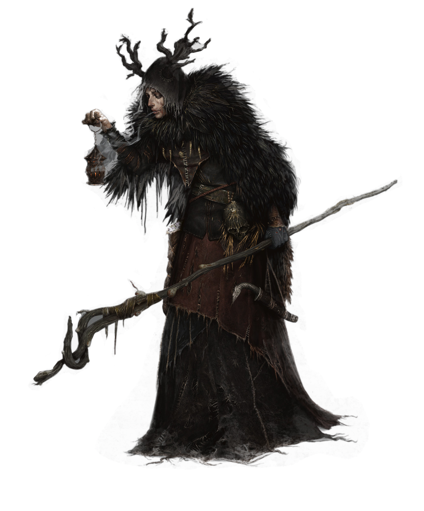

# The Droughtwalker

**The Droughtwalker.** Pel travels alone between Ursa and Ki'ma, which not even Aysana Biko could do during Droughtbane, making his living giving blessings and enchantments along the way. 

Pel is in many ways much older than he looks. he has long shiny black hair, thick and lustrous and hardened by the sun. A host of aphid-sized arthropods lives in tiny holes they've burrowed into Pel's staff or among the furs he wears in the deep cold deserts or as a formal garment in town. he soothes them with a near-constant stream of mapacho smoke.

**Sympathy for the devils.** Pel is not without compassion for the shadow spirits that have risen in the Mor'Dani—the gods have forsaken them and allowed the banes to destroy the once magical lands on which their ancestors lived. But he also acknowledges that there is something thrilling about the power the Shadowir wield.

Pel believes there is corruption and that there are diseased spirits (demons who are corrupting the Mor'Dani), but Pel does not blame those who have been corrupted, and he will not kill them if he can avoid it. 

> ## Pel Grim, Droughtwalker
>*Elf ranger, druid, sorcerer chaotic good*
> ___
>
> - **Armor Class**  17
> - **Hit Points**  45 (3d8)
> - **Speed**  30ft.
>
>___
>|STR|DEX|CON|INT|WIS|CHA|
>|:---:|:---:|:---:|:---:|:---:|:---:|
>|11 (+0)|18 (+4)|15 (+2)|13 (+1)|15 (+2)|15 (+2)|
>___
>
> **Skills** Arcana +4, Athletics +3, Insight +5, Nature +4, Perception +10, Survival +5
>
> **Condition Immunities** Charmed (A), Sleep (magic)
>
> **Senses** Passive Perception 15, Insight 15, Investigation 11, Darkvision 60ft.
>
> **Languages** Common, Druidic, Kyote, Shadow
>
>### Abilities
>
>**_Spellcasting._** Drawing on the divine essence of nature itself, Pel can cast spells to channel that essence.
>
>**_Favored enemy._** Constructs
>
>**_Natural Explorer._** Desert
>
>***Cloak of Elvenkind.*** *While hood is up:* WIS checks to see Pel are at disadvantage; Pel's DEX (Stealth) checks have advantage.
>
>### Actions
>
>**_Longbow._** *Ranged Weapon Attack:* +9 to hit, 600 ft. _Hit_: 1d8+4
>
>**_Quarterstaff._** *Melee Weapon Attack:* +3 to hit, reach 5 ft. _Hit_: 1d6.
>
>**_Chill Touch._** *Spell Attack:* +5 to hit, 60 ft. _Hit:_ 2d8.
>
>**_Ray of Frost._** *Spell Attack:* +5 to hit, 120 ft. _Hit:_ 2d8.
>
>**_Primeval Awareness._** Pel can expend a ranger slot to sense aberrations within one mile.
>
>**_Gathered Swarm:_** As a bonus action, Pel can summon his swarm to cling to his weapons; once each turn can deal an extra 1d6 force damage, and the swarm moves the creature up to 5 ft. toward or away from him.
> 
>### Spell List
>
>| Level |  | Slots |
>|:---:|:------------|:----:|
>|  0  |  Chill Touch, Druidcraft, Mage Hand, Mending, Mind Sliver (UA), Prestidigitation, True Strike |
>|  1  | Arms of Hadar, Create or Destroy Water, Entangle, Expeditious Retreat, Faerie Fire, Goodberry, Healing Word, Hunter's Mark, Silent Image, Speak with Animals, Thunderwave | 4|
>|  2  | Misty Step | 3 |
