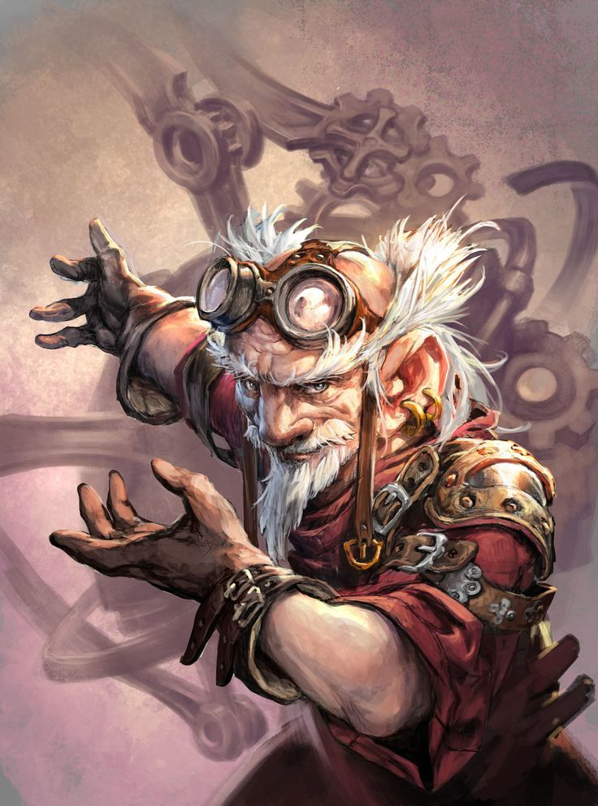

<table style='width:100%'>
    <tr>
        <td>
            
Former Cardinal Artifex of Mar'Illith whose controversial theories about the arcanology of Erith's deep past cost him his career.

            
Developed arcane technology for Ketya Stoutwhistle's chronoscope, which she and Zorin Stoutwhistle used to study the position of the stars during banes past and present.

            
Currently travels Ethewa as a tinker.

            
Befriended Steam at the Ethewa calling of the clans and gave him <a href='../05-items/petros-puzzlebox.md'>Petro's Puzzlebox</a>.

        </td>
        <td style='width:50%'>
            
            <ul style='list-style-type:none; padding-left:0'>
                <li style='margin:0'><strong>Class</strong> Artificer (Alchemist)</li>
                <li style='margin:0'><strong>Race</strong> Ylve</li>
            </ul>
        </td>
    </tr>
</table>