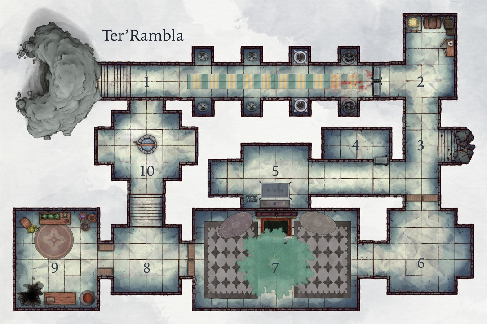
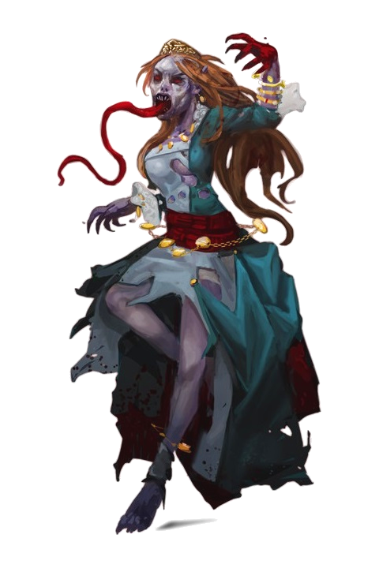

# Overview

Shadowir have descended on Ter'rambla, a secret temple of the Great Tree tended by the Danosi on for the Shadowir:
* Maw and Paw set the trap to keep people out and scare them 
* They want to take this Great Tree node offline 
* So, Maw & Paw are trying to hack/disable the Great Tree ... but this takes time 
* They become frustrated and try many types of distasteful magic. 
* Some of the detritus of these attempts quietly slither away while Maw fumes, taking the whole thing very personally, while Paw stands motionless, waiting.
* The Flayed One is inanimate until the braziers are lit, which resurrect her. She is terrified and suffering, capable of acting only out of this single-minded pain with aggression.  

# A1: Hall of Heroes

* As soon as you reach the stairs that start just 10 feet into the shaded cave, the heat of the day yields, replaced with a different kind of discomfort. The **hewn rock stairs** descend quickly into dim light, leaving off at the opening of a dark hallway, from which a sense of unabiding malice exhales.
* The **entrance to the hallway** is well cut, and three mammoth sheets of 10'x10' timber completely cover both walls and the ceiling at the entrance. 
* Pausing at the south wall of this "foyer" reveals an **intricate carving of two giant trees** stacked on top of one another, the canopy of the first growing underground into the roots of the second, which after breaking ground stretches tall above the planes toward the two suns of Erath. The timber on the opposite wall is carved into a giant tree whose canopy stretches past the wall onto the ceiling covering it entirely.
* A **set of stone stairs** descends a further 15', now into darkness. Magical darkness allows any light source to illuminate a 10' radius, with further 10' of dim light but nothing more. 
* The **air smells acrid** and tastes faintly of copper. The temperature is comfortable but humidity is high.
* As the party makes its way into the hall, their steps are strangely muffled. Whenever they stop, the **high hewn roof of the hall** reflects no echo, the air dies to a standstill, and an expectant silence floods the room. 
* The hall appears **lined with alcoves** and extends about 60' from the base of the stairs before ending in impenetrable **darkness that cannot be dispelled** with magic less than 3rd level. Attempts to illuminate the vicinity are swallowed in darkness completely.  
* Each of the first four alcoves contains a version of the same statue—**a figure sitting cross-legged on a stone pedestal carved to resemble a tree**. The faces and bodies of each are unique, as is the way each conveys a sense of strength and community. The statues are so specific in personality, it's clear they're portraits of real, not mythical, heroes. 
* **Two large braziers** have apparently replaced the occupants of the third pair of alcoves. Their style and design not only stand out; players may also notice a sense of foreignness about them (DC 15). Perhaps it is just their proximity to the darkness that consumes the rest of the hall, but there is a shadow of 'wrongness' (DC 16) hanging off these artifacts. 
* There are a **very few small spots on the floor** (DC 12) that turn out to be human blood (DC 15). A trail of spots the party discovers disappears into the darkness.

## Background

Two Shadowir Haddukim, Maw and Paw, have killed a young adult apprentice of Ter'Rambla and used them to bait this trap, which consists of the following: 
* The impenetrable **darkness** that shrouds the hallway. 
* The **body of an apprentice** Ter clan Isquero, which is staked to the doors and enveloped in darkness. 
* A **pair of statues** in the last set of alcoves. They represent hood figures standing with arms outreached above them. 
* The **pair of braziers**. When lit, they resurrect some force that inhabits the corpse, The Flayed One. 

There is also the question of how Maw and Paw set the trap outside the Stone Door but end up in [The Great Room](#a7:greattreeroom), which is on the other side of the door.

## Encounter

Think of this encounter as proceeding in multiple phases, outlined below:
* [Phase 0: The darkness is calling](#phase0:thedarknessiscalling)—does the party advance to the braziers?
* [Phase 1: Someone is home](#phase1:someoneishome)—The Flayed One begins entreating the party.
* [Phase 2: Shedding some light](#phase2:sheddingsomelight)—does the party light the braziers?
* [Phase 3: It's on](#phase3:it'son)—roll initiative!
* [Winding down](#windingdown)—what does the party discover and do they enter the temple? 

### Phase 0: The darkness is calling

* The party reaches the encounter location when they **enter the hall** and discover the darkness.  
* This phase ends once a party member **advances to or beyond the braziers**. 

If this is not already clear to the party, make it so and give them a chance to prepare.

### Phase 1: Someone is home

* If the party **move beyond the braziers**, The Flayed One entreats the party from the darkness, using a young woman's voice with maybe a hint of sarcasm:  
  * "Please … can you hear me? Where is he? Please … help u--" 
  * A coughing fit quickly cuts her off, followed by laughing then silence. 
  * After a pause, she will resume, this time sticking to small noises: sucking teeth, smacking lips, moaning softly on occasion. They are the sounds of  someone trying to soothe themselves. 
* Those who **enter the darkness** are completely unable to see and within reach of the Flayed One.

> ### The Flayed One 
> Use the stats for a [Dolgaunt]( https://www.dndbeyond.com/monsters/dolgaunt) with the following adjustments: ***HP*** *105*, ***DC*** *13*, ***Tentacle:*** *5(1d6+2)*, ***Unarmed strike:*** *3(1d4+1)*, ***Vitality drain:*** *6(1d4+4)*

### Phase 2: Shedding some light 

The only way to lift the darkness is to light the braziers. This phase starts as soon as that happens, regardless of how. 

#### If the braziers are lit

* They will smolder for 10 turns (about 1m) before catching light:  
* The Flayed One becomes increasingly loud, agitated, and (somehow) LARGER.  
* Once per round the braziers sputter, illuminating the hall in a brief flash of cold gray light (less than 1s). 
* The illumination effect is like a strobe and the characters are able to make out snapshots of The Flayed One, alternating between the visage of a beatific female goblyn martyred with a black arrow and a wildly rabid humanoid straining against a set of iron restraints.  
* The flash also exposes the two statues in the last set of alcoves. Those who fail a DC 16 WIS save assume the figures are real (rather than statues). 

#### Each time the braziers sputter

* The Flayed One has a 25% to recover 2d10 hp but not beyond its max. 
* Players continue to save against WIS unless  
  * they have successfully saved in a prior attempt 
  * someone in the party has attacked one of the statues 
* At the end of Turn 10, the braziers erupt in steady flame—the darkness lifts. 

This phase ends once the braziers are fully lit.  

### Phase 3: It's on 

Once the braziers are fully lit, The Flayed One reaches full strength and size (Medium). This marks the start of the phase. 
* Now the darkness has lifted, the party sees The Flayed One staked to a pair of stone doors, standing in a spray of dark fluid. It is obviously suffering and completely aggro.  
* During the first turn, The Flayed One makes a final bid to free its restraints (Strength, DC8), and its body looks like it will give before the restraints. Its arms and legs and neck are thoroughly torn from the struggle. Anyone who attacks at this point has advantage.  
* The Flayed one will continue to struggle each turn as their main action until they are freed or killed. 
* When The Flayed One is illuminated for more than 5s, there is a chance **(DC16 Perception)** that the party will notice their skin is literally crawling, as though it were an independent organism trying to abandon the body. 
* If The Flayed One manages to free themself, players will notice that as they does so their limbs pass right through the restraints. It's as though their flesh willing cleaves and then rejoins itself. 
* Once freed, The Flayed One will attack the party until they are killed. If the party retreats, they will not pursue the party past the braziers. 
* If they are not killed, The Flayed One will remain in Ter'Rambla until the next drought-rise, at which time they will exit and roam the area as a Wandering Monster, seeking the home of their former host. 
* This encounter ends when The Flayed One dies, the party has fled, or the braziers are extinguished. 

## Winding down 

At the end of the encounter, and after the smoke clears, the party can explore. 
* **If the party lights their torch from the braziers**, the braziers will die; however, the light the torches take on penetrates the magical darkness to 30', with 5' of dim light.
* The party notices the last set of alcoves contain starkly different statues than the rest of the hall (DC8). Set in roughly cut black stone, the hooded figures seem newly made. Their ghoulish, distorted faces moan skyward, arms upraised, as if imploring the heavens to bleach the Land. 
* The great stone doors remain shut. They look as if they are granite; a DC15 INT check will reveal they are not. 
* An impressive tableau of figures carved into the stone includes a diverse range of life across a range of environments. Many are strange; some are obviously mythical; most are neither. The rendering extends from a sky at the top down into the depths of Erathh itself. 
* Most prominent is the figure of a great tree that transects the entire relief, from the earth and the oceans through the surface to the sky. It's reaching limbs terminate in the stars. 

# A2: The store

* Just beyond the doors lies a 15'x25' open room, with a hallway branching to the south (down). It appears to be a store/resupply area for those who pass through. barrels and kegs and crates of supplies are stacked along the north wall, which is also home to a small pen and a bed of straw.
* A large cabinet containing various sundries stand against the east wall next to a pile of a dozen or so large bags of grain. Ceramic vessels containing various teas and coffee line the shelves, along with clay urns containing fermented vegetables. Bunches of dried herbs hang from the ceiling, along with hooks and chains for dried meats, all of which are empty.
* A diverse collection of weapons are stowed on racks attached to the entrance walls. Any reasonable adventurer recognizes that this is where visitors leave their weapons before entering the hall.
* **Dhenn**, the young store clerk is mortally wounded, hiding under a trap door beneath the bed of straw in the northeast corner. The door can be found by investigation (DC 18), which reveals drops of blood in the straw and prompts closer inspection of the floor below.
* Dhenn is clutching a baby goat in fear.
    > ### Whisper to a scream
    >When the door is opened,here is a chance Dhenn cannot maintain his grapple on the goat. 
    >
    >While out of turn order, roll d6 once per minute. On a 6, the grapple fails.
    >
    >When out of turn order, have Dhenn make a **STR** check (DC 10).
    >
    > If the goat breaks free, it darts down the hallway and lets out a scream that can be detected with **Perception** (DC 8).

## Encounter: Panic room

* Opening the trap door reveals a young male goblyn with pale green skin and fire red hair. He is sitting in a 5'x5' pit, wide-eyed in terror, clutching a kid goat to his bloodied chest.
* As soon as the party tries to speak to Dhenn, he stops them with an urgent whisper. "Please don't wake IT. Please!," looking down and then up again for emphasis.
* A closer look reveals that Dhenn is sitting in what looks like a puddle of black oily sludge. It is a [Black Pudding](https://www.dndbeyond.com/monsters/black-pudding).
    > ### Dhenn's pudding and a "got" goat
    > Use the stats for a Black Pudding in the MM, with ***150 HP***
    > 
    > The goat, meanwhile, is infected with the same Shadow plague as Skol, which can be discerned on **Investigation** (DC 15).
* As soon as any action is taken, the **Goat struggles** to break free (make a turn order grapple check for Dhenn, **STR** DC 10). If the goat breaks free, it flees down the hall, where the darkness and muffled acoustics swallow it.
* It is possible that the pudding leaves behind a gem-key for Area 6 (10%).

# A3: The cave-in & the west hallway

## The cave-in

* A stairway down, off the main hallway is buried in rubble. Only the first 5-10' are still accessible.
* Both the rocks and stairs appear damp in anything but magical light,** which would reveal clearly the presence of **Shadow Oozes x 2. Otherwise, make a Perception check.
* These are the same creatures who attacked Jorem Greentide, a fact the party recognizes as long as they correctly identify the oozes (Perception DC 14). Only Skol can recognize that this is the same stuff that transferred part of itself from Greentide to him. -->
> ### Dark, all-consuming horrors
> Use the stats for Shadow Ooze (CC 287) with these changes: Remove ***Aura of Darkness*** ability. 
>
* Any creatures that pass must make a DEX check (DC 14) to avoid stumbling into the oozes, which take advantage of surprise and attacks.
* Creatures engulfed and drained by the oozes look as though they are fading out of existence, not merely losing life. Indeed, such a creature suffers no visible wounds, nothing more than a wan complexion. But with each round it becomes less and less substantial, dissolving into shadowy monads, each relentlessly driven to consume the world.

## The West Hallway

* The hallway leading west from the cave in is a relative safe zone. Nothing lies in wait, and there are no traps. If the party are going to take a short rest anywhere, here is probably ideal.
* If the party rests, they will see the remains of Maw's unsuccessful attempts to poison the Great Tree** as they quiver and slither along the floor in the dim attenuated light. If they investigate further **(DC 15) they realize they are not creatures but hostile "magic" made physical. . . bits of infused arcanoflesh.

### Quivering, slitheirng arcanoflesh

* Each of Maw's unsuccessful attempts to poison the Great Tree results in the release of small bits of shadow magic infused into matter, let's call it shadow- or aracanoflesh.
* These animated bits of shadowflesh creep and slither away.
* Occasionally they "combust" exploding in creative shadow energy, which can result in the creation of a creature, typically oozes and aberrations.
* Throughout their adventure in Ter'rambla, Maw continues to create these fragments as a byproduct of his foul aims, and they continue to migrate throughout.
* The shadowflesh explains much of the population in the dungeon, and they serve as a ready source of wandering monsters:
    #### Wandering Monster Table
    | d8 | Result |
    |:----:|:-------------:|
    | 1 | [Gelatinous Cube](https://www.dndbeyond.com/monsters/gelatinous-cube) |
    | 2 | [Phase Spiders](https://www.dndbeyond.com/monsters/phase-spider), 1d4 |
    | 3 | [Cave Fishers](https://www.dndbeyond.com/monsters/cave-fisher), 1d4 |
    | 4 | [Slithering Trackers](https://www.dndbeyond.com/monsters/slithering-tracker), 1d4 |
    | 5 | Wind Demons (CC 93), 1d8  |
    | 6 | Gloom Flowers (CC 188, 50 HP/each) x 2 |
    | 7 | Mandriano (CC 261) x 2 |
    | 8 | Megapede (CC 266) x 2 |

# A4: The study

* Normally a place where Danosi can rest, craft, or socialize at Ter'rambla, this 20x10 common room is also an ideal place to house guests of repute or those who require privacy not afforded by the Great Room.
* The walls are covered in tapestries and a large collection of small paintings, each an impressively detailed miniature of an epic landscape.
* The long wall opposite the door holds two large bookshelves, each on either side of a wide standing desk that could double as a workbench.
* Above the workbench hangs a cabinet with drafting supplies and assorted arcane curios—among them various alchemical ingredients in jars with strange names, paints, inks, and a ball that never stops bouncing.
* A large inkwell on the bench is close to overflowing.** It is an **Ink Guardian (CC285)**, and if anyone disturbs the papers strewn across the bench or opens the **small drawer below, the ooze will attack.
  > ### Damage, Ink
  >Use the **Ink Guardian** stats with no adjustment. 
  >
  >If the bottle is saved, a new ink guardian will grow within 3d8 hours.
* **The _small drawer_ beneath the bench contains a _collection of keys_.** One of those keys opens the trap door in [The Store](#a2:thestore), another the west doors to the Great Room in Area 6, and yet another opens the east doors there.
* A large wooden table and chairs sit near several casks of unopened ale and wine, along with several ceramic vessels of tea, coffee, and tobacco.
* Along the short wall, furthest from the door, a trio of hammock bunks are pitched from rope and lumber.
* If the party lingers, they will almost certainly (80%) encounter **Doppelrats (TOB 123).

# A5: Prayer room

* An altar with a prayer rug set before it are the focal point of this large room.
* Above the altar is a mosaic with a hole where a piece appears to be missing. Close inspection reveals a divot where something like a gem would be set into.
* An investigation check (DC 15) exposes a glistening sticky mucus that numbs the fingers slightly to the touch. The mucus clings to the depression in the mural and is spattered on the mural, and small needle-like hairs are embedded in the thick goo.

## Encounter

Any creature that lingers within 20' of the northwest corner of the room i ambushed by a _Roper_ suspended from that space. It has been surviving on the skin bats and doppelrats that have begun to infest the halls.
> ### Hanging time
> Use the **Roper** stats (MM) with these changes: ***HP 120***.
>
> Remember that the **Roper** has a 50' range, so even if the party gets the key and skips this area, the roper can pull them into the prayer room.
> 
> The roper ideally waits for the party to open the metal chest at the foot of the altar so that it can steal its contents as well.
> 
> **If the party defeats the roper and cuts open its stomach**, they will find a collection of gems, some raw and uncut, other fine, worth a total of 600g.
> 
> **One particularly fine gem (The Green Heart Gem) stands out on Investigation (DC 15).** The color of the gem matches the brilliant green, deep and enveloping, as that of the mural's Great Tree heart.

## Loot: Roper stomach

An Alexandrite gem (600GP). This is the key to the secret passage into the Great Room.

  > ### The Gem key to the mural passage
  > The Green Heart Gem unlocks the secret passage to the Great Room. 
  > 
  > To activate the passage, insert the gem into the depression at the base of the muaral, in the dark brown soil, and then slide it upward from the soil to the canopy.
  > 
  > When used, the gem changes color as it is pushed from seed to sky. The wall behind the steel box then disappears (it's about 5' tall), granting access to the Great Room.
  > 
  > There are also 5 x d10 rolls on the 100GP gemstones table. These are random other victim's gems or those gems it has found on its own, most likely here in this room.
  > 
  > There are also two platinum rings worth 100 GP each.

## Loot: Metal altar chest

* **+1 Shortsword.** The hilt and pommel are wrought with motifs of a Great Tree.
* **Sentinel Shield.** This thick wooden shield is made of Banda wood. It is surprisingly light.
* **Ring of Mind Shielding.** A black stone ring inland with opal, the interior of the band is engraved with runes.
* **Slippers of Spider Climbing.** Lightweight canvas slippers embroidered with magical silk.
* **A locked journal.** The lock is magical and has a **Rune of Abjuration** on it. It is a 5th-level rune, and those who fail an Int saving throw **(DC 15)** take **6d10 radiant**; those who succeed take half damage.
* **Hat of Disguise.** A nondescript felt hat.
* **Brooch of Power (use Pearl of Power).** This carved wooden brooch in the shape of a tree leaf has a platinum pin.
* A pair of loose cotton drawstring pants and several totems & trinkets of little value and no magic power.

# A6: Common Room

* **This antechamber to the Great Room contains communal facilities for preparing and serving food**, large gatherings, and ritual sinks for washing before ceremonies.
* The room is infested with *cobbleswarms*. To place 1d8 swarms roll a d20 and apply to the 4x5 square core of the room, moving from left to right, row to row, starting with the upper left.
    > ### Follow the cobbleswarm road
    > * Use the stats for Cobbleswarms. 
    > 
* **If a player trips in this room**, there is a DC 12 (Perception) chance that Maw & Paw will detect them.
* **Make two wandering monster checks** immediately when the party enters the double doors.

# A7: Great Tree room

* This is the room where the party can showdown with Maw & Paw, two Shadowir agents. 
* If the party gets to this point in less than 90 minutes, they can prevent the poisoning of the Great Tree by defeating, driving off, or exhausting Maw.
* If the party takes more than 90 minutes**, Maw & Paw will have succeeded in poisoning tree and leave behind a gift in the form of a **Corrupting Ooze (TOB 311, 115 HP).
* If the party enters from the passage in the [Prayer Room](#a5-prayer-room), they have a chance to surprise Maw & Paw.
* If they enter from the Common Room, Maw & Paw, will know of their arrival because of the noise of cobbleswarms in that room.
* Together Maw & Paw constitute a *Spectral Guardian*, and they share the same hit point pool.

 