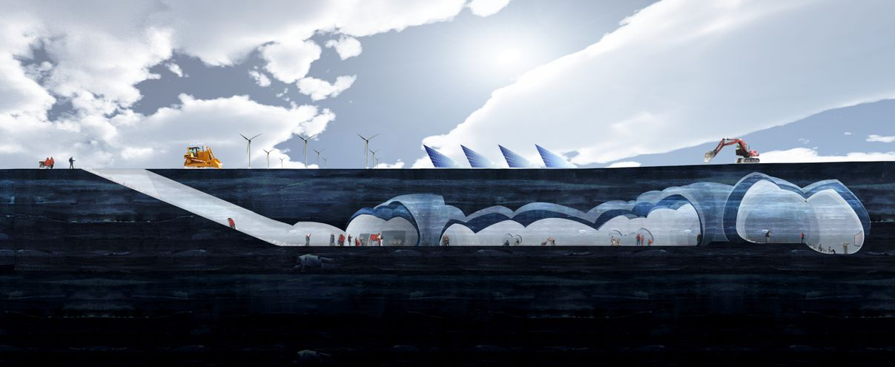

### Glacial village

The Iceberg Living Station is essentially a gigantic igloo: an iceberg gets hollowed out and everything necessary for research (including people) is placed inside. But won't that melt? you ask. Yes, which is the idea: after seven to 10 years, it'll be gone, and the researchers won't have to worry about removing the discontinued research center, as is usually the case.

