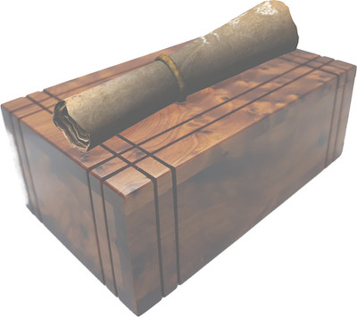

*This phenomenally strong box made of oiled hardwood is wrapped with pairs of simple but expertly inlaid bands of metal. The bands traverse the box and culminate in a ring on top. A rolled-up scroll of raw paper is nestled in the ring like a napkin.*

*The box appears to be without lid, hinge, lock, or seam. The faint smell of anise lingers on its surface.*

*The scroll, printed with blue-black letters inked with some sort of hand stamp, contains this message:*

>"Before you can learn about your armor, you must understand your tools. As in all things, the key lies in harmony. Only thus will you reveal my gift."    *—**A**rnogast*
>