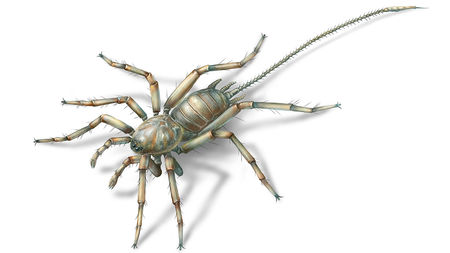

*A matte black arthropod with eight legs and a cord-like jointed tail, reminiscent of a scorpion, that ends in a fine needle.*

*The overall impression is incongruous; the exquisitely jointed body seems too much the product of design rather than nature, and yet when held in the hand, its weight, the delicateness of detail, and a sense of presence combine to argue otherwise.*

*The carapace of the Shadiphid (aka Shadow Spider) is engraved with a set of eight finely detailed glyphs that become iridescent when touched.*

---

# A Shadow Spider

* The Shadiphid (aka Shadow Spider) is an artifact of shadow that the Haddukim use to bend both the spirit and flesh of their enemies to the Shadowir.
* Yeemik's Shadiphid, however, has been *cured* of this pestilence by the Old Crone.
* Instead of corruption and poison, Yeemik's spider will cast **Crone's Portal of Fate**, weaving the spell herself, and opening a crossing to Erith.
* The spider must be activated, however, by moving a series of glyphs on the Shadiphid into place. 
* A Mastermind-style game is used to simulate the Shadiphid's activation code:
> ### Activating the Shadow Spider
>
> * There are eight glyphs, each with its own corresponding color.
> * There are a number of positions located around the body. That number is equal to the number of members in the party.
> * These positions represent the _slots_ of the Shadiphid's activation sequence and can be simulated by a Mastermind puzzle with _n_ positions.
> * With each attempt to enter the sequence, the Shadiphid presents a reponse. The response provides feedback similar to the game Mastermind.
> * After a number of attempts equal to the number of legs on the Shadow Spider, each additional attempt must pass a DC15 (Dex) check or roll a 30% chance to break the Shadiphid.
> * Once the correct sequence has been entered, the Shadiphid activates.

# Activating the artifact

Once the activation sequence has been entered, the maturation of the Shadow Spider is complete, and the spider will emerge from its now crystalline chrysalis:

* As the slotted glyphs grow in their luminescence, an energy begins to collect on the surface of the Shadiphid's legs and hairs, among the spines in its tail. The energy spreads from the glyphs along its limbs to consume the carapace, where it unites with the the glphys on its back. 
* The energy pours over the spider's head, spillling life into each of its ten faceted eyes. The spider awakens and begins consuming its chrysalis.
* Two minutes later the spider emerges. After a few movements that look like a cross between Bambi's first steps and a boot test, the spider moves to a clear area and starts growing.
* It takes about 5 minutes for the spider to reach full size, during which time she explores her surroundings and frequently nibbles at her rear end. Players with _passive Perception > 13_ will notice that she is activating her spinnerets.
* When the growth phase is done, the spider has the body size of a large rabbit, and she stands the height of a medium-sized dog.

Once activation is complete, and the spider has finished growing, it will immediately look for a doorway or any other suitable space across which she can weave a portal door. 

Once she's constructed the base of her web, she will wait for consent from a creature. Consent amounts to standing near the web and touching it.

As soon as one touches the web, the spider, with unsurprising grace, will rapidly entomb the creature in silk, attaching it to the web as though it were prey. She will then bite the entombed creature, draining it of life until there is nothing left but withered silk and what looks like large flakes of dry skin.

The energy of her feast is visible within her body, which is now crawling with impossibly small glyphs, undulating in organic patterns that spread from the spider and course through the strands of her web, extending even into the space around it. 

And then, at once, the energy is gone. The patterns erased. The creature has passed through the portal. The spider goes quiet. Waiting, again.

# How the Shadiphid Came to Yeemik
 
Here's how Yeemik remembers the story:

* A sick old chrone showed up in our camp one night. In the middle of the night. I mean, they just somehow wandered. A shrivelled old ... just wandered unnoticed past the guard and the wolves. Wandered right into the middle of a goblin camp, stepped to the ring and passed out by the fire, happy as a pup. Dril and I looked at each other and then went back to our business drinking and planning out the day. And we forgot all about them until the next morning.
* Well, when I saw them there in peace early the next a.m., I knew they was good magic, so I woke 'em, told them I'd  help'em.
* She said some kind of creature had infected her, like a parasite. And the chrone was going to die.
* Then she told me a strange story. The chrone said that as the disease progresses, the parasite offers to share more and more of its power with her, just as it continues to take her life.
* I remember the old chrone saying, 'Daughter' (she called me daughter *smiles*). 'Daughter,' she says, 'the parasite thinks he is corrupting me, but is I who turn him. He cannot see this, but I use him in ways he does not understand.'
* And then she showed me the shadow spider ball, which she called the Shadiphid, but it wasn't a spider then. Just a worm. A worm in amber.
* She told me I'd know when it was ready. And when it was, I should give it ... well, that I should give it to you."
* Someone would 'storm' the hideout. (Didn't exactly nail that part, eh? *laughs). 
* There would be parlay. And she told me that at some point when you were in NEED, I should give it to you, and it would let you escape. 
* She said if I did that, I could keep the spider after you were gone.
