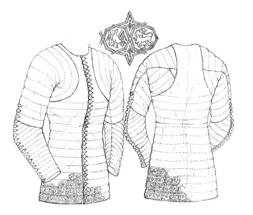

---

*This doublet is embroidered with the deepest shades of black silk infused with the magic of The Old Crone. The magical silk reinforces the doublet, giving it the strength of the toughest leather. The night-colored embroidery swims with runes that are almost imperceptible to the naked eye but once noticed appear to move and change shape with the light. When worn and attuned, the armor grants Oisin the same protection and abilities as if she were to wear [Glamor Studded Leather](https://www.dndbeyond.com/magic-items/glamoured-studded-leather).*

*Sewn into the doublet is a hood. When the hood is drawn up, the runes modulate and reflect any light that hits it, granting Oisin the same effect as if she were to wear a [Cloak of Elvenkind](https://www.dndbeyond.com/magic-items/cloak-of-elvenkind)*

*For the purposes of attunement, the Trickster's Doublet as if it were two items: one rare, one uncommon.*