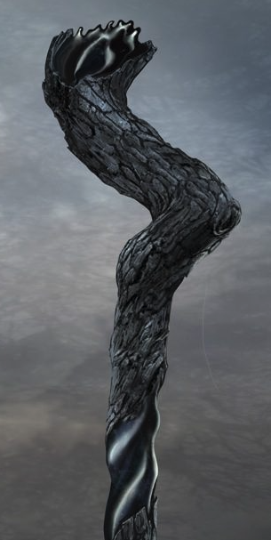

*Staff, very rare (requires attunement by a Sorcerer, Warlock, or Wizard who is either of evil alignment or a child of shadow)*

---

This black wooden staff is constructed from the heart of a Shadow Wood tree, and its corrupt heritage is evident to anyone who regards the staff with more than a casual eye, imparting whispers of dread and disorientation. Two brief sections of the staff have been stripped of its fibrous pith and polished to a black mirror. On closer inspection, there are faint grooves in these polished sections that look like they could be runes or letters, but they are indecipherable. Using [Comprehend Languages](https://www.dndbeyond.com/spells/comprehend-languages) identifies the grooves as Shadowspeak, but they remain illegible, bleeding into one another. 

The Shadow Wood Staff has these properties:

***Backbiter.*** Anyone who touches the staff who is not attuned to it must make a Constitution (DC 16) saving throw. On failure, the target suffers 8d4 necrotic damage and gains one level of exhaustion.

***The Gift of Shadows.*** On attunement, snippets of esoteric, obscure writing become legible where the bark has been stripped and polished. Though the writing is incomplete, the Shadow Wood Staff grants access to these spells, which can be cast without material components and use your spellcasting ability:

* *At will: [crushing curse](/05-items/umbral-staff#crushingcurse)*
* *2/day each: [maddening whispers](/05-items/umbral-staff#maddeningwhispers), [shadow strike]((/05-items/umbral-staff#shadowstrike))*
* *1/day: [living shadows]((/05-items/umbral-staff#livingshadows))*

***Power at a price.***  After you cast a spell with the staff, make a Constitution (DC 16) saving throw. If you fail, you suffer 7 (3d4) psychic damage.

***Shadowspeak.*** While you are attuned to the Shadow Wood Staff, you can read and speak Umbral.

***Bloodthirsty.*** While you wield this staff, whenever you land the killing blow on a creature of CR 1 or greater, you gain 5 (2d4) temporary hit points.

***Insatiable.*** With further study of the staff, as you force yourself to discern its maddening whisper, you believe that were you to dedicate yourself to this fell weapon, you might be able to learn a great deal about the nature of "Shadow" itself.

## Spells

### Crushing Curse

*Shadow magic cantrip*

**Casting Time:** 1 action  
**Range:** 60 feet  
**Components:** V, S  
**Duration:** Instantaneous

You utter a word of Shadowspeak. Choose a creature you can see within range. If the target can hear you, it must succeed on a Wisdom saving throw or take 1d6 psychic damage and be deafened for 1 minute. A deafened creature can repeat the saving throw at the end of each of its turns, ending the deafness on a success.

This spell’s damage increases by 1d6 when you reach 5th level (2d6), 11th level (3d6), and 17th level (4d6).

### Maddening Whispers

_2nd-level shadow magic_

**Casting Time:** 1 action  
**Range:** 30 feet  
**Components:** V, S
**Duration:** 1 minute

You whisper a string of Shadowspeak toward a target that can hear you. The target must succeed on a Charisma saving throw or be incapacitated. While incapacitated by this spell, the target’s speed is 0 and it can’t benefit from increases to its speed. 

To maintain the effect, you must use your action on subsequent turns to continue whispering; otherwise, the spell ends. The spell also ends if the target takes damage.

### Shadow Strike

_3rd-level shadow magic_

**Casting Time:** 1 action  
**Range:** 90 feet  
**Components:** V, S  
**Duration:** Concentration, up to 1 minute

With a short phrase of Shadowspeak, you gather writhing darkness around your hand. When you cast the spell, you can unleash a bolt of darkness at a target within range. Make a ranged spell attack. If your target is in dim light or darkness, you have advantage on the roll. On a hit, the target takes 3d8 necrotic damage and must make a successful Wisdom saving throw against your spellcasting DC or be frightened of you until the start of your next turn.

On each of your subsequent turns, you can use your action to choose a target in range and make another ranged spell attack. 

After each successful attack you make with this spell, you must succeed on a Constitution (DC 16) saving throw or take 7 (3d4) psychic damage.

At Higher Levels. When you cast the spell using a spell slot of 4th level or higher, the damage increases by 1d8 for each slot level above 3rd.

### Living Shadows

5th-level enchantment (shadow)

**Casting Time:** 1 action  
**Range:** 120 feet  
**Components:** V, S  
**Duration:** 1 minute

You whisper sibilant words of Shadowspeak that cause shadows to writhe with unholy life. Choose a point you can see within range. Writhing shadows spread out in a 15-foot-radius sphere centered on that point, grasping at creatures in the area. A creature that starts its turn in the area or that enters the area for the first time on its turn must make a successful Strength saving throw or be restrained by the shadows. A creature that starts its turn restrained by the shadows must make a successful Constitution saving throw or gain one level of exhaustion.

A restrained creature can use its action to make a Strength or Dexterity check (its choice) against your spell save DC. On a success, it frees itself.