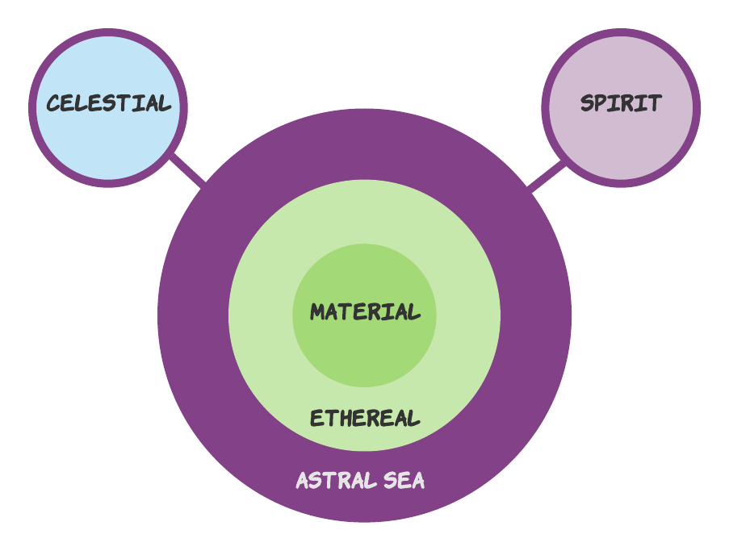

The world in which you find yourself, Erith, exists completely outside the default D&D multiverse, making your curious transit to this world all the curiouser. 

This guide outlines the key planes of existence that your characters and magic interact with. Think of Wangari's paladin ability [Divine Sense](https://www.dndbeyond.com/sources/phb/classes#DivineSense), which detects celestial, fiendish and undead creatures. Where do they come from? Read on.

## Overview

**Erith** exists in a cosmos that has its own set of planes. Each plane carves out a different dimension of reality. Though separate, travel among planes is possible—with the right magic, innate ability, or other means.

			  
## Material Plane

* The [**Material Plane**](/06-lore/01-cosmology/02-material-plane) is where Erith is located. It is where you stand today. It represents the kind of the time-space existence with which we are all intimately familiar.
* **Indigenous creature types**: Beasts, Constructs, Dragons, Giants, Humanoids, Oozes, Plants.

## Ethereal Plane & the Astral Sea

* The **Ethereal Plane** is a mostly featureless plane that surrounds the Material.
* The Ethereal plane serves primarily as a conduit for travel from the Material Plane to other planes in the great **Astral Sea**, which contains all things and all beings. 
* Few if any creatures are native to the Ethereal Plane.

## Spirit Planes

* The Spirit Planes reflect different aspects of the collective consciousness in which all beings participate.
* **Indigenous creature types:** Aberrations,  Elementals, Fey, Fiends, Great Spirits, Monstrosities, Undead. 

## Celestial Planes

* The Celestial Planes are home to the gods and those who serve them.
* The gods themselves revere certain Great Spirit creatures that they discovered when they came to Erith.
* In fact, it is their reverence for these Great Spirits that motivated the gods to stay and tend Erith, much as celestial shepherds.
* **Indigenous creature types:** Celestials, including Deities and Angels. 

___
> ##### Celestial vs. "Good"
>---
>Celestial beings, including Deities and Angels, are not necessarily of Good alignment.
>
>This differs from the default D&D multiverse, where celestial beings are almost universally Good.  
