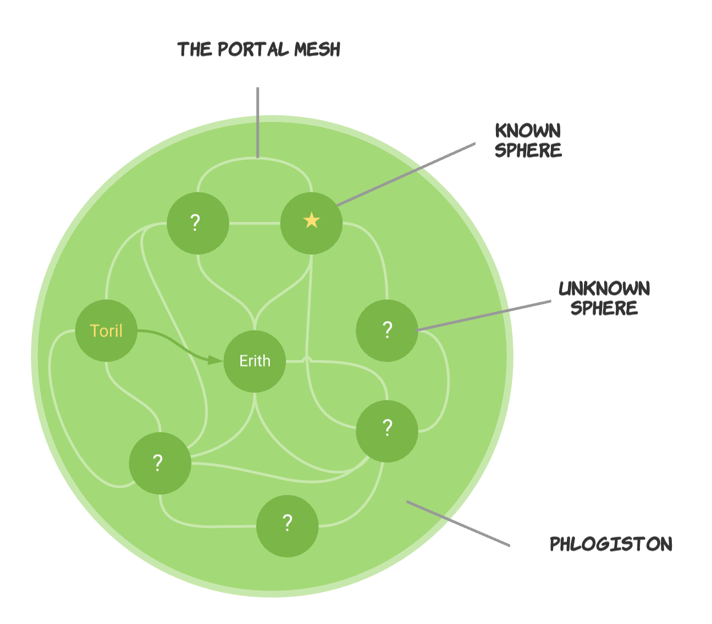

The prime material plane contains myriad **crystal spheres**. Each sphere is its own universe, and together these spheres make up the Dungeons & Dragons multiverse.

You come from [**Faerûn**](https://forgottenrealms.fandom.com/wiki/Faer%C3%BBn), a continent on the planet **[Toril](https://forgottenrealms.fandom.com/wiki/Toril)**, which is in the sphere (universe)  called **[Realmspace](https://forgottenrealms.fandom.com/wiki/Realmspace)**.

In addition to Toril, there are several other spheres known to students of cosmology and the arcane arts. These **known spheres** contain the worlds that are part of the official D&D canon. For example, **[Crystalspace](https://forgottenrealms.fandom.com/wiki/Crystalspace)** is home to one of the most iconic creatures in the game, the terrible mind flayers.

However, there are far more **unknown spheres** than known ones. The planet **Erith** resides in one of the unknown spheres. When you used the artifact the old crone gave Yeemik the goblin to cross from Toril to Erith, you made a journey to a place that no one from the known spheres has ever even dreamt of.

When you made that crossing, you used the **Portal Mesh** to do it. The Portal Mesh is a network of extraphysical "tunnels" that connect the crystal spheres. The locations of the portals into the Mesh constantly shift, and only a rarified few know how to find them. Even fewer know how to use them, and those who do guard their secret zealously. 

The Old Crone introduced the Mesh to Oisin, when she made Oisin a Portal Witch.
