Angels can be good or evil, but they are *always* light. Fiends can also be good or evil, but they are *always* beings of darkness. 

 

> ### A note on alignments
> 
> Unlike *Light* and *Darkness*, or *Chaotic* and *Lawful*, good and evil only have meaning relative to a particular world view. You can measure the presence of light in a system, and you can measure the degree of entropy, but you cannot measure good and evil until you establish a morality. 

### Angel of Death

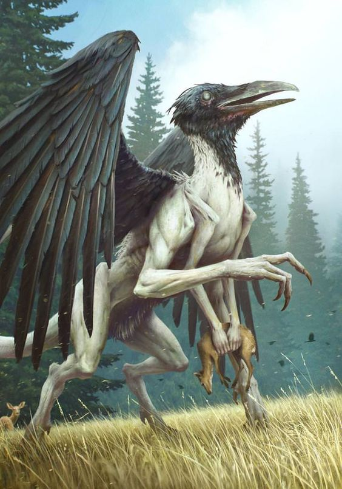

### The Old Crone

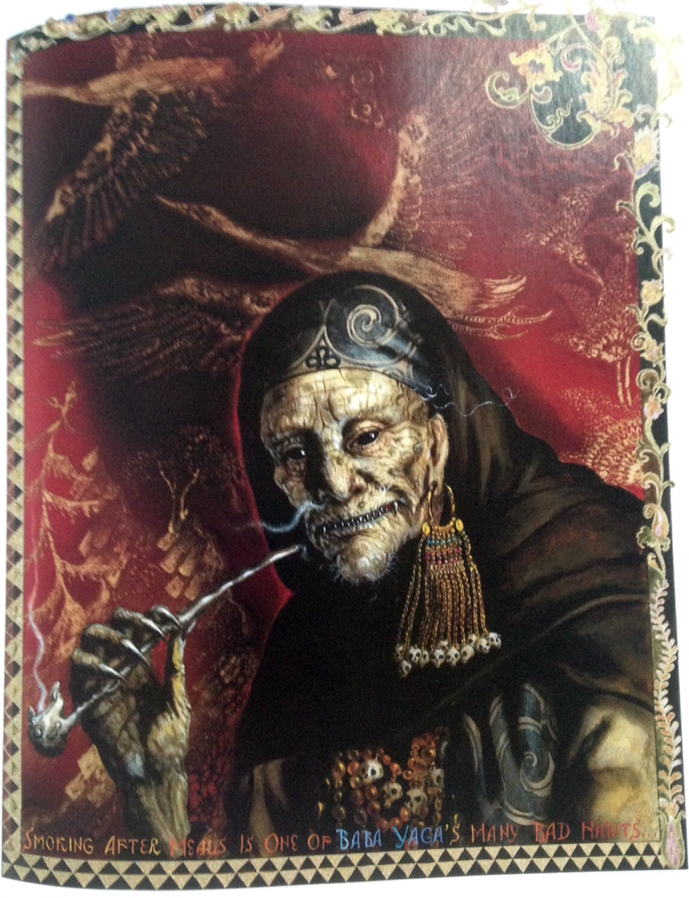

### Ewu

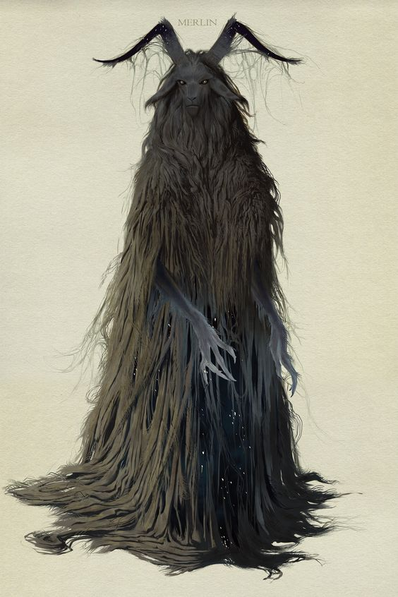

### Groll Simian

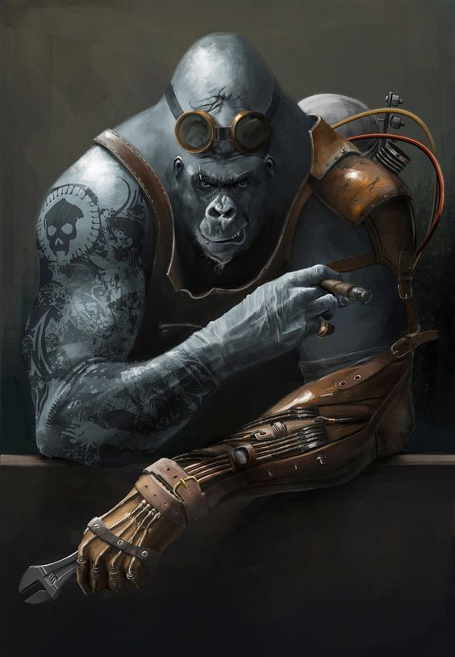

### Jorem Greentide

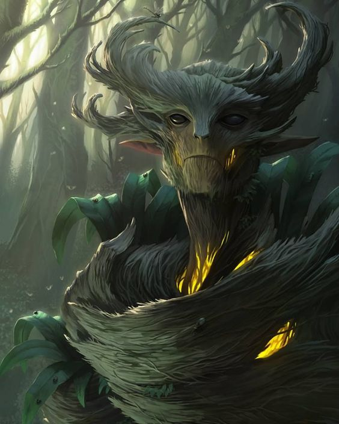

### Jorem Mantanid

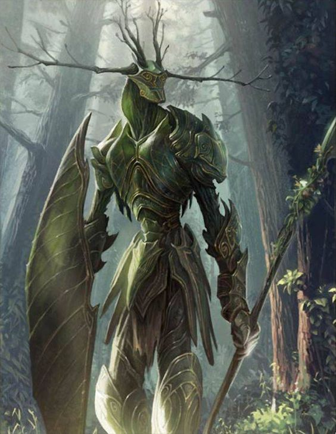

### Jorem Symbiant

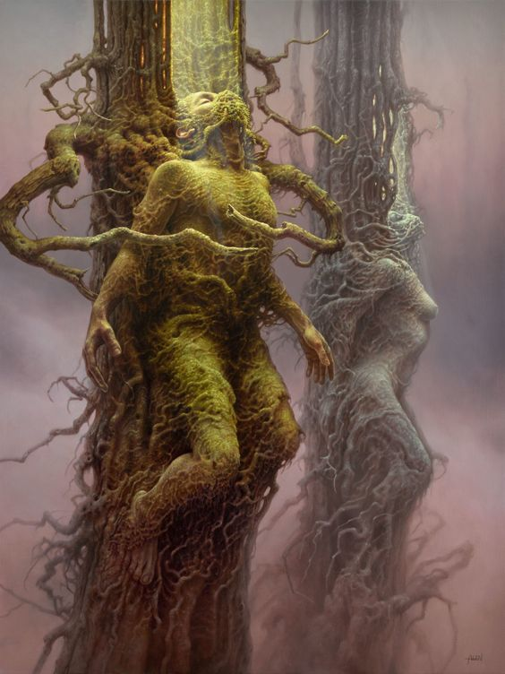

### Maw

Avatars are not the *actual* entity or personality they represent. Instead, spiritual entities use avatars, through their manifestation and behavior, to accomplish the true aims of their spiritual masters, who are practically inscrutable, and so it is almost always more productive to take an avatar at face value rather than try to infer the intentions of an avatar's master.

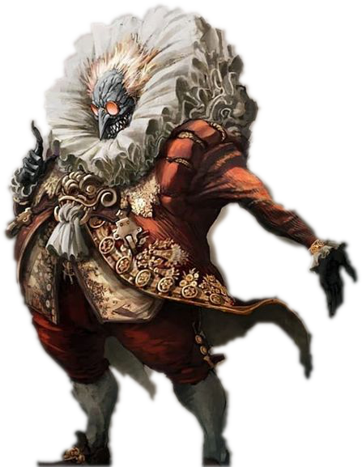

In this image, imagine Kai'pow'eh, avatar of Kai, trapped in a living prison by Maw, who _is_ the prison itself:

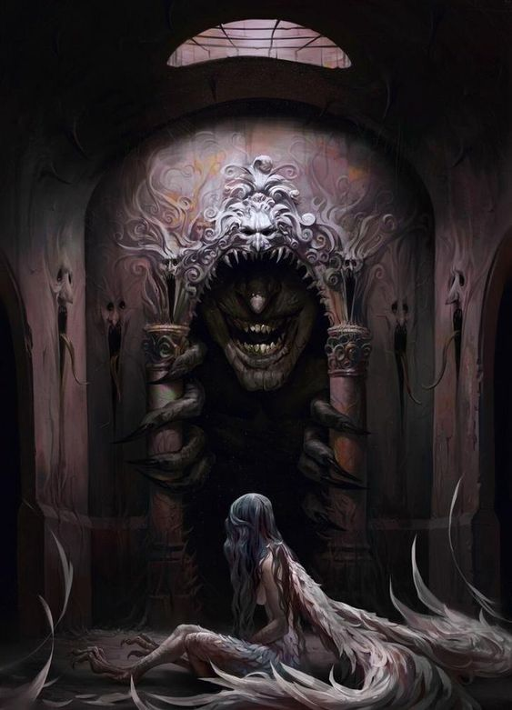

### Paw

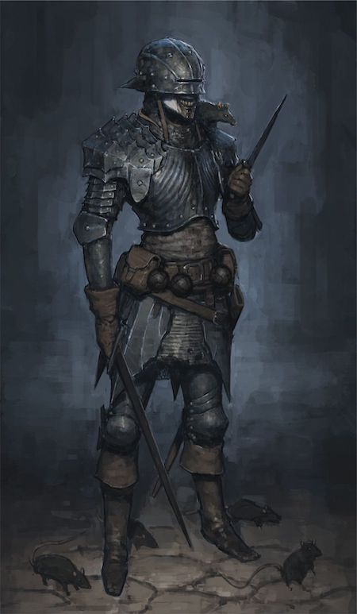

### Psilocybian

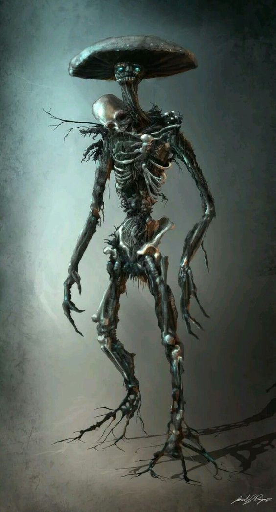

### Redemption fiend

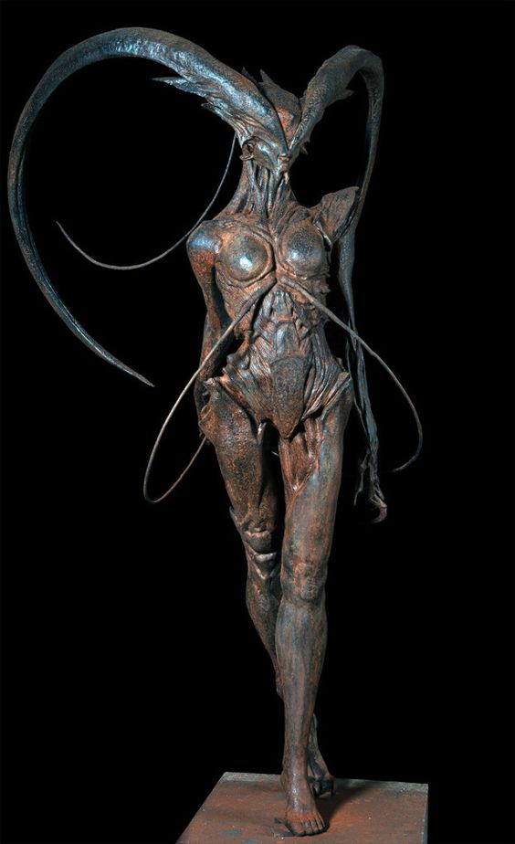

### Sister of the Undine, Lokuma'kai

### Sister of the Undine, Nymph

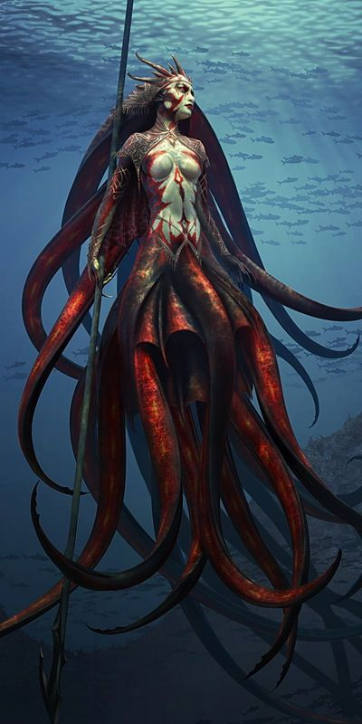

