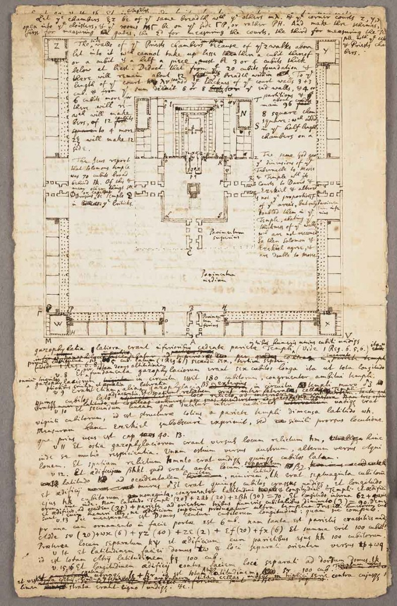
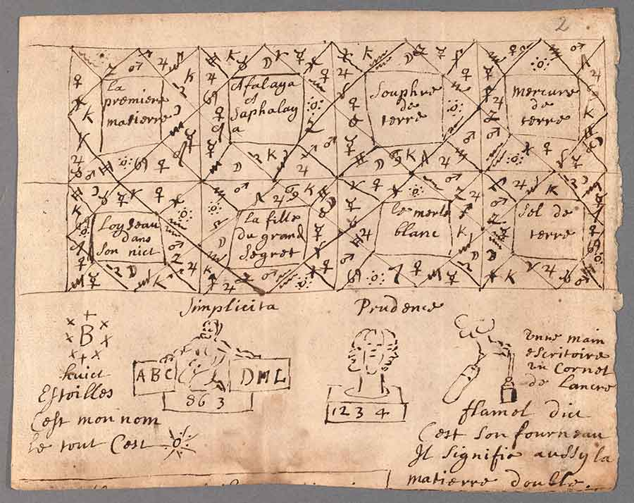

Many misperceive Artifecture as simply "magical tinkering," eliding therefore, at their own peril, the reality of the matter—the hybridization of the arcane and the scientific yields the most potently productive and destructive products of any art or technology yet discovered.

### The Autarch's Temple

Here's a great idea—the design of the Autarch's Temple encodes arcanotechnological secrets. The Autarch's Daughter (or at least one of them) thought she'd found these secrets, but she must have missed something, because her bid to cure the Banes failed. Here's how Isaac Newton looked at Solomon's Temple:

> #### Isaac Newton: Artificer?
> Newton believed that the architecture of Solomon’s Temple held divine secrets that had long ago been lost. He based his description and this sketch upon detailed comparisons of the biblical Hebrew text with the Septuagint and the Vulgate versions. *—[The Newton You Didn't Know](https://www.huntington.org/verso/2020/01/newton-you-didnt-know)*

### Artificer's notebook

### Alchemical doodles

