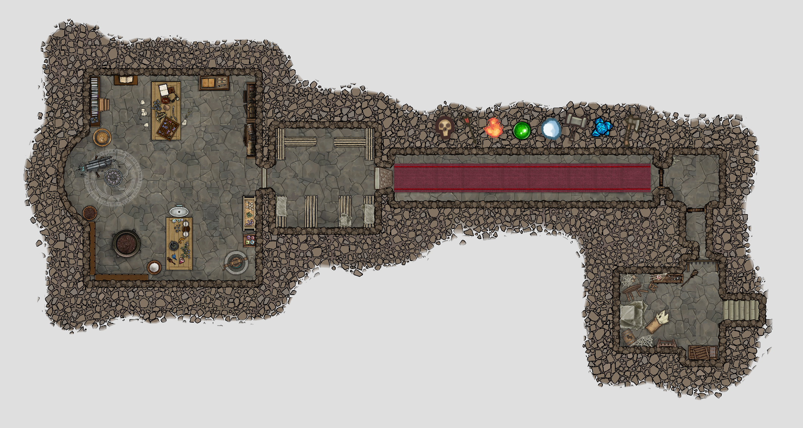

Karin & Hayald Stoutwhistle are dwarven siblings who have traveled from the far east of Pern to find the their parents' old home in the forests below the White Suns. They have left their families behind to learn the truth of their parents' mysterious past and, with luck, clear the family name.

# Adventure outline

* Karin & Hayald loved their parents, Ketya & Zorin Stoutwhistle. They were an especially close family in a tight-knit clan.
* But though their parents loved telling stories of their youth after dinner and how they met and eloped from the very community in which they now live, they never spoke of their time abroad in Ethewa.
* Their sudden return to the village a century later, with no explanation of where they'd been, to take up farming no less, stained their reputation with the rest of the clan. A stain that survives even after their death.
* Their surviving children, Karin & Hayald, have left their families and journeyed across the continent to find an explanation and clear their name.
* The party discovers Karin & Hayald at the site of their parents' former home, arguing. It turns out they have come all this way and there is no sign of their parents having been here at all.
* Hayald has started wondering whether the notes they found in their mother's diary were fiction. Karin points out this is ridiculous, since the notes very clearly describe the nearby fey circle on the hill. Ok, but all that proves is that they were here. If they lived here, what happened to their home? Did they build so poorly that it would not have withstood a single lifetime? 
* The truth is that Ketya & Zorin built a very sturdy home, but not at the site Ketya wrote about in her diary—when she wrote wistfully of Ethewa, it was of this land and the secret laboratory they built in the cellar to research the banes as druid arcanists.
* The entrance to their parents' lab is less than 50 feet from where Karin & Hayald stand when the party encounters them, but it is hidden behind an illusion.
* When the party helps them find the entrance, the pair try to hire the party to go inside with them.
* They enter a false cellar at the front. A secret passage leads to a heavily trapped hallway that guards the lab and its store room.
* While the store room is empty, the lab is in almost pristine condition, preserved no doubt with magic. The exceptions are a sophisticated telescope that has fallen over and a [deck of tarot cards](https://www.reddit.com/r/DnDBehindTheScreen/comments/k4dj69/sardons_tarot_card_curse_a_homebrew_tarot_card/) that has spilled onto the floor. 
* The lab is divided into two areas—an area devoted to astronomy and one that serves as a druidic wet bench. The centerpiece of the apothecary area is an ornate ritual cauldron. The centerpiece of the astronomy area is the large telescope that sits at the center of the lab beneath dome in the cellar ceiling made of unworked earth and soil. 
* The dome is right beneath the fey circle. When activated, the circle fuels magic that projects the sky onto the dome, where it can be studied in detailed with the telescope and other arcane instruments. The true power of this observatory is that it can display the sky of any time in Erith's history. . . If only it weren't broken.
* The ritual cauldron in the lab is actually a [Cauldron of Rebirth](https://www.dndbeyond.com/magic-items/cauldron-of-rebirth). When the Karin & Hayald learn the true story of their parents, they award it to the party with gratitude.
* While investigating the ornate ritual cauldron, one of the Stoutwhistle siblings bumps into a party member—some of the shadow seeds spill into the cauldron!
* If undetected, the seed germinates into an [umber hulk](https://www.dndbeyond.com/monsters/umber-hulk) or a [dao](https://www.dndbeyond.com/monsters/dao). 
* If the party do not kill the shadow creature within two rounds, the creature will escape using Tunneler or Earthglide.
* The laboratory also contains the Stoutwhistle's research library and their lab books. 
* The lab books are written in a mix of Sylvan and Giantish. Anyone who understands Sylvan and studies the books closely can learn to read Giantish.
* The lab books describe their research, their theories about the banes, and the apothecary/magic item business they built to fund their discoveries. 
* There is no mention of why they left, at the peak of their research and with an extremely high-end clientele.
* But leave they did. A century after they left, Zorin & Ketya abruptly showed up at their village in Pern, quietly bought a secluded farm, got married, and had children. They never spoke of their research again and lived the remainder of their lives as happy outcasts.
* When Karin & Hayald hear this story, their worries about their parents' possible misdeeds turn to shame and then pride. They take the jewels (being dwarves) and the diaries (being people), and they leave the rest in the stewardship of the party. The party now have a safe house and a small amount of coin.
* They also have the option of trying to repair the telescope and activate the fey circle so that they can do their own research and map the stars.

# Topside

As the party make their way through the forests that blanket the base of the White Sun peaks toward Kima (or Noran'dil), they hear voices arguing loudly over the sound of a rushing creek to the northeast.

When the party investigates, they find themselves at the mouth of a clearing in the forest. To the east, the creek wanders down the mountainside, continuing south past the party. Camped on the bank are what look to be a pair of dwarves having a heated exchange.

One of the dwarves (Hayald) is fuming that they have come all this way and there is no sign of their parents having lived here at all.

Hayald has started wondering whether the notes they found in their mother's diary were fiction. The other dwarf (Karin) points out this is ridiculous, since the notes very clearly describe the nearby fey circle on the hill. Ok, but all that proves is that they were here. Hayald is unconvinced. If they lived here, what happened to their home? Did they build so poorly that their home would not have withstood a single lifetime? What kind of dwarf would do that?

> ### A research center for evocation magic
>
> The truth is that Ketya & Zorin Stoutwhistle built a very sturdy home, but not at the site Ketya wrote about in her diary—when she wrote wistfully of Ethewa, it was of this land and the secret laboratory they built in the cellar to research the banes before they spread to their homelands (and their clan community) in Pern.

# Cellar doors

The entrance to their parents' lab is in the meadow about 50 feet west of where Karin & Hayald stand when the party encounters them, but the cellar doors are camouflaged behind an illusion. The party can detect the illusion with a successful Intelligence (Investigation) check, DC 20. Of course, [Dispel Magic](https://www.dndbeyond.com/spells/dispel-magic) also works.

When the party helps them find the entrance, the pair try to hire the party to go inside with them.

The plain wood cellar doors are secured with iron hasps and set into a mortared casement built from the same stone as found in the nearby creek. A thoroughly desiccated but persistent vine appears to have grown such that it lashes the door shut (HP 12). Anyone who succeeds on DC 10 Wisdom (Survival) check can see that the vine is not from anywhere nearby.

# Cellar

They enter a false cellar at the front. A secret passage hides behind the weapons rack to the north.

# Greeting room

The secret passage lets out in a short hallway with a locked door (DC 18). That door opens into a 10 X 10 room that is unfurnished, except for a faint spot on the floor where a podium or a book stand once lived and a statue of a crow with two pairs of eyes, its beak wide open.

Looking through the hole in the crow's beak gives only the faintest of views of the 50' hallway on the other side but the impressively carved stone door at the hallway's end is fascinating, even at this distance.

The door to the west is reinforced wood and secured with a sophisticated steel padlock (DC 25).

If the party break the door down, the trapped hallway on the other side will trigger immediately. Roll initiative and go to the Fear Hall.

If the party speaks into the beak, they will hear the sound of a voice that Karin and Hayald immediately recognize as their mother's. The voice says, "Welcome, traveler. We will be with you in a moment."

No matter how long the party wait, there is no follow up. Ketya Stoutwhistle is dead, after all. Further speech into the crow's beak yields the same reply: "Welcome, traveler. We will be with you in a moment."

# Fear Hall

This well-appointed hallway is dominated by an ornate stone door that is almost overwhelmingly fascinating. The reliefs cut into the stone illustrate an array of symbols representing the different schools of magic, each surrounded with icons of the plants and creatures who manifest them. 

The hallway, which serves heavily trapped. Use DMDave's [Fear Gauntlet](https://www.patreon.com/posts/patreon-dump-4-30906814).

When the party triggers the trap, the alluring effect of the door becomes one of sheer terror 

# Store Room

This stone room is lined with wooden storage shelves that are long empty, except for a four crates covered in sheets:

* The first crate contains a bag of cinders, some kind of hardwood (Investigation, DC 12), not native to here (DC 18).
* The second crate contains four large jars of a muddy paste, made from some kind of loam (Investigation, DC 15). The soil element of the loam is similar to that the party encountered in the Mordani (DC 20).
* The third crate contains broken phials of liquid. Close Investigation (DC 12) confirms they were once potions.
* The last crate contains several intact phials:
    * [Potion of Diminution](https://www.dndbeyond.com/magic-items/potion-of-diminution)
    * [Oil of Etherealness](https://www.dndbeyond.com/magic-items/oil-of-etherealness)
    * 4 x [Potions of Healing](https://www.dndbeyond.com/magic-items/potion-of-healing)

# Laboratory

* While the store room is empty, the lab is in almost pristine condition, preserved no doubt with magic. The exceptions are a sophisticated telescope that has fallen over and a [deck of tarot cards](https://www.reddit.com/r/DnDBehindTheScreen/comments/k4dj69/sardons_tarot_card_curse_a_homebrew_tarot_card/) that has spilled onto the floor. 
* The lab is divided into two areas—an area devoted to astronomy and one that serves as a druidic wet bench. The centerpiece of the apothecary area is an ornate ritual cauldron. The centerpiece of the astronomy area is the large telescope that sits at the center of the lab beneath dome in the cellar ceiling made of unworked earth and soil. 
* The dome is right beneath the fey circle. When activated, the circle fuels magic that projects the sky onto the dome, where it can be studied in detailed with the telescope and other arcane instruments. The true power of this observatory is that it can display the sky of any time in Erith's history. . . If only it weren't broken.
* The ritual cauldron in the lab is actually a [Cauldron of Rebirth](https://www.dndbeyond.com/magic-items/cauldron-of-rebirth). When the Karin & Hayald learn the true story of their parents, they award it to the party with gratitude.
* While investigating the ornate ritual cauldron, one of the Stoutwhistle siblings bumps into a party member—some of the shadow seeds spill into the cauldron!
* If undetected, the seed germinates into an [umber hulk](https://www.dndbeyond.com/monsters/umber-hulk) or a [dao](https://www.dndbeyond.com/monsters/dao). 
* If the party do not kill the shadow creature within two rounds, the creature will escape using Tunneler or Earthglide.
* The laboratory also contains the Stoutwhistle's research library and their lab books. 
* The lab books are written in a mix of Sylvan and Giantish. Anyone who understands Sylvan and studies the books closely can learn to read Giantish.
* The lab books describe their research, their theories about the banes, and the apothecary/magic item business they built to fund their discoveries. 
* There is no mention of why they left, at the peak of their research and with an extremely high-end clientele.
* But leave they did. A century after they left, Zorin & Ketya abruptly showed up at their village in Pern, quietly bought a secluded farm (a disgrace for a Pernian dwarf), got married, and had children. They never spoke of their research again and lived the remainder of their lives as happy outcasts.
* When Karin & Hayald hear this story, their worries about their parents' possible misdeeds turn to shame and then pride. They take the jewels (being dwarves) and the diaries (being people), and they leave the rest in the stewardship of the party. The party now have a safe house and a small amount of coin.
* They also have the option of trying to repair the telescope and activate the fey circle so that they can do their own research and map the stars.

These precious objects are also among the items in the room:
* [Goggles of Night](https://www.dndbeyond.com/magic-items/goggles-of-night).
* [Sending Stones](https://www.dndbeyond.com/magic-items/sending-stones).

## Ketya and Zorin's notebooks

Zorin and ketya Stoutwhistle eloped when they were barely adults and left their community for the forests at the base of the Great White Sun Peaks. There they pursued their studies of erith magic as arcanist-druids. The focus of their research—the Banes.

In particular, they noticed that healing spells took longer to take effect during Drought Bane than once the banes had broken. Their hyopthesis was that the banes were not a cause, merely a symptom. The cause, they reasoned, was some draining of source of evocation magic, which infuses life with growth and productivity. 

That deficit of evocation energy in turn throws all of the biological networks and ecological systems that rely on this magic out of balance. The result, they believed, is the banes.

To test their theory, they built a cauldron designed purely for healing experiments. They also compared their data to the historical record, to the extent that they could find one. (It was this lack of historical record that drove Ketya to build the chronoscope that lies broken on the floor.)

> ### A common friend
>
> Ketya & Zorin knew petro when he was a much younger ylve. They were aware of his conjectures about Erith's deep past, particularly the time before the banes. 
>
> According to the Stoutwhistle's, Petro believed that when the gods arrived it was not their first time on Erith—it was a **return**. 
>
> Not even Petro realized that their arrival was not merely a return, but a homecoming.

They also built a telescope and began charting the skies to more precisely correlate their research into the astrological cycles of Erith and how they were affected by the banes.

However, their research was very expensive, so they started an apothecary, one that quickly became by appointment only in Kima. But as their renown grew among the elite, they closed their store in Kima and forced their customers to come visit them here.

> ### Gobsmacked
>
> All of this is news to Karin & Hayald—their parents never spoke of any of this. They'd never mentioned anything of druidry, let alone esoteric theories of the banes.
>
> And why did they even care about the banes—the banes have little impact on them in Pern (yet).

From there, the story gets murky. Their research continued to progress, but each success provoked new tests, requiring more and more sophistication. They became hugely prolific creators of magic items, catering to very rich patrons.

Suddenly, about 80 years ago, they just left. Not only that, but it's unclear whether they left or fled.

That same year, after a century away, Zoran & Ketya Stoutwhistle showed up at their village, quitely bought a secluded farm (to the consternation of all and sundry), got married, and had children. Never speaking a word of it again. 

Karin and Hayald have been vaguely ashamed of their parents their entire lives. Now they see them as heroes.

## The Chronoscope

The telescope is broken. To fix it, the party must replace the lens and activate the sky sensor so that the earthy dome above the room becomes a lens to see into the sky of any time in the past.

